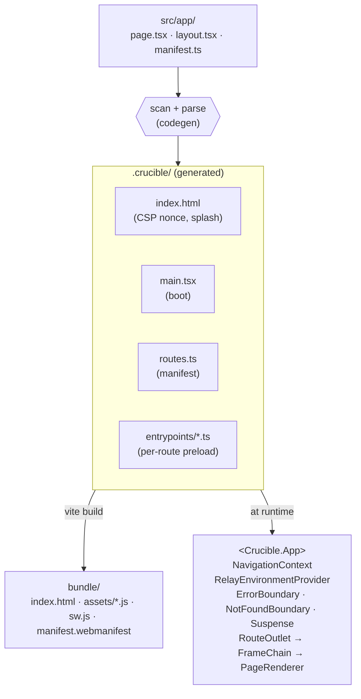

<p align="center">
  
</p>

<p align="center">
  <strong>Web apps that feel native.</strong>
</p>

<p align="center">
  A Vite plugin + small runtime for building React apps with file-system routing, parallel slots, intercept routes, and PWA polish — designed for SPA + GraphQL deployments where the whole app runs in the browser.
</p>

---

## What this is

Crucible is a **client-only SPA framework** wired to a GraphQL backend (we use Relay; any GraphQL client works in principle). Codegen generates a typed route tree from the file system; the runtime is ~5,000 lines of TypeScript that you can read in an afternoon.

It composes three things:

1. **A Vite plugin** that scans `src/app/`, generates typed route entrypoints, manages a service worker + PWA manifest, and stamps a fresh CSP nonce per build.
2. **A small runtime** with file-based routing, layouts, parallel slots, intercept routes, default fallbacks, type-safe URL params and search params, scroll restoration, focus management on navigation, and view transitions.
3. **An optional Electron integration** so the same code runs as a desktop app without rewriting auth, IPC, or window logic.

If you've used Next.js's `app/` directory, the conventions will be familiar. If you haven't, see [`docs/routing.md`](./docs/routing.md).

## Inspirations

- **[Pastoria](http://pastoria.org)** — the route entrypoint + preloaded queries pattern Crucible uses for data loading is a faithful adaptation. Crucible keeps the parallel chunk-and-data preload, but page authors use a direct `query` export.
- **Next.js (App Router)** — file-system routing, layouts, parallel slots, intercept routes, default fallbacks, the `metadata` export shape, and the title-template API are all conscious adoptions. Crucible aims to be "the same conventions, smaller scope, all client-side."
- **React Router** — `<Link>` ergonomics, `useNavigate`, scroll-restoration semantics borrow heavily.

## Why this exists

- **Plain SPA semantics.** Every file runs in the browser. No serialization boundary, no "is this server or client" question. State management is React. Data is Relay. Predictable.
- **A real desktop story.** Electron is a one-import operation. Crucible bundles the IPC contract, protocol handler, and window-open security so `desktop/main.ts` is ~30 lines and ships.
- **PWA polish that actually polishes.** Splash painted before any JS parses (no cold-start flash), service worker that caches the app shell, manifest authored in TypeScript with type-checking, theme-color synced to OS chrome.
- **Open-source-bound.** No `react-*` imports in the runtime. The package is internal-private today; the architecture is built to publish standalone when proven.

## Quickstart

```bash
bun add react-crucible
```

```ts
// vite.config.ts
import { crucible } from "react-crucible";
import react from "@vitejs/plugin-react";
import tailwindcss from "@tailwindcss/vite";
import { fileURLToPath } from "node:url";
import { dirname, resolve } from "node:path";

const here = dirname(fileURLToPath(import.meta.url));

export default {
  root: resolve(here, ".crucible"),
  plugins: [crucible({ appRoot: here }), react(), tailwindcss()],
};
```

```tsx
// src/app/layout.tsx
import * as Crucible from "react-crucible/crucible";
import type { ReactNode } from "react";

export const metadata: Crucible.Metadata = {
  title: { template: "%s · App", default: "Welcome" },
  themeColor: "#ffffff",
  description: "An app you wrote.",
};

export default function RootLayout({ children }: { children: ReactNode }) {
  return (
    <main>
      <header>{/* nav */}</header>
      {children}
    </main>
  );
}
```

```tsx
// src/app/page.tsx
import * as Crucible from "react-crucible/crucible";
import { graphql, usePreloadedQuery } from "react-relay";
import type { page_HomeQuery } from "./__generated__/page_HomeQuery.graphql";

export const query = graphql`query page_HomeQuery @preloadable { viewer { email } }`;

export const metadata: Crucible.Metadata = { title: "Home" };

export default function Home({ data }: { data: import("react-relay").PreloadedQuery<page_HomeQuery> }) {
  const result = usePreloadedQuery(query, data);
  return <p>Hi, {result.viewer?.email ?? "stranger"}.</p>;
}
```

```bash
bun run codegen   # scans src/app/, emits .crucible/, writes index.html
bun run dev       # vite dev server with HMR
```

That's a running PWA with type-safe routing, preloaded GraphQL, route-aware metadata, and a working service worker. Add `src/app/splash.tsx` for the pre-mount splash; `src/app/manifest.ts` for installable-PWA config; `desktop/main.ts` + `desktop/preload.ts` for Electron.

## What you get

### Routing

Every file under `src/app/` becomes part of the route tree by convention:

| File | Role |
|---|---|
| `page.tsx` | Renders at this URL exactly. |
| `default.tsx` | Renders when no `page.tsx` matches and the slot has no preserved state. |
| `layout.tsx` | Wraps every descendant; receives `children` plus named slot props. |
| `loading.tsx` | Suspense fallback for this frame. |
| `error.tsx` | Error boundary fallback for this frame. |
| `not-found.tsx` | NotFound boundary fallback for this frame. |
| `[id]/` | Dynamic param. Available as `params.id` on the page props. |
| `[...slug]/` | Catch-all. `params.slug = "a/b/c"`. |
| `(group)/` | Organizational, not part of the URL. |
| `@dialog/` | Parallel slot — passed to the parent layout as a `dialog` prop. (`@<name>/` works for any name; the directory name becomes the prop name.) |
| `(.)foo/` | Intercept route — fires on soft nav (Link click), bypassed on refresh. |

See [`docs/routing.md`](./docs/routing.md) for depth.

### Data loading

Each `page.tsx` can export `query = graphql\`... @preloadable ...\``. Crucible's codegen emits a route entrypoint that pre-loads that query in parallel with the page's chunk, so the page doesn't suspend on data after the route splits. Use parallel routes (`@slot/`) when independent UI regions need their own route/data loading.

`store-and-network` is the default fetch policy: cached records render instantly while a refresh fetches in the background. Schema changes (detected via a build-time hash of `schema.graphql`) invalidate the localStorage cache so stale records can't crash a returning user.

See [`docs/data-loading.md`](./docs/data-loading.md).

For local-first apps, Crucible can route Relay through an opt-in local GraphQL executor backed by browser SQLite/OPFS. The server sync contract stays app-owned; see [`docs/local-first-sync.md`](./docs/local-first-sync.md) for the recommended outbox/change-feed shape.

### Metadata

`<DocumentHead>` is mounted automatically. Every layout + the page contributes a `metadata` export (typed `Crucible.Metadata`) that gets merged outer-to-inner. Title supports `template` slots à la Next.js. First-class Open Graph, Twitter Card, and `robots` directives.

```ts
export const metadata: Crucible.Metadata = {
  title: { template: "%s · Crucible", default: "Welcome" },
  themeColor: "#ffffff",
  openGraph: { siteName: "Crucible", image: "/og.png" },
  twitter: { card: "summary_large_image", site: "@Crucible" },
  robots: false,  // shorthand for "noindex, nofollow"
};
```

### Splash + boot

Author `src/app/splash.tsx`:

```tsx
export default function Splash() {
  return (
    <div style={{ display: "grid", placeItems: "center", height: "100dvh" }}>
      
    </div>
  );
}

beforeCrucibleMount(() => {
  // Inline JS that runs as soon as the browser parses index.html.
  // Use it to hide the splash early on hot-reload, gate on auth, etc.
});
```

Crucible renders the splash to static HTML and inlines it into `index.html`, so it paints **before any JS bundle parses**. After React mounts, call `Crucible.dismissSplashScreen()` and the inline CSS transition fades it out. Cold-start without flash, even on slow connections.

### Service worker + PWA

`src/app/manifest.ts` exports a typed manifest. The plugin emits `/manifest.webmanifest`. The runtime registers a service worker that:

- Network-firsts navigations with an `/index.html` fallback (works offline)
- Cache-firsts hashed bundle assets (Vite content-hashes filenames)
- Versions the cache by content hash; new build → new cache → old purged on activate

See [`docs/pwa.md`](./docs/pwa.md).

### Electron

```ts
// desktop/main.ts
import { app } from "electron";
import { setupCruciblePlatform } from "react-crucible/electron";
import { join } from "node:path";

const platform = setupCruciblePlatform({
  bundleDir: join(__dirname, "../bundle"),
  preloadPath: join(__dirname, "preload.js"),
});

platform.registerProtocolSchemes();
app.whenReady().then(() => platform.openMainWindow());
```

```ts
// desktop/preload.ts
import { setupCruciblePreload } from "react-crucible/electron/preload";
setupCruciblePreload();
```

Same routes, same components, same Relay environment — running as a desktop app. The preload exposes a typed `window.crucible` namespace with platform-specific implementations of `openExternal`, `copyToClipboard`, etc. Web code calls the same API; the platform layer dispatches.

See [`docs/electron.md`](./docs/electron.md).

### Pluggable strategies

Every cross-cutting concern is a typed prop on `<App>`, replaceable per-app:

```tsx
<App
  routes={routes}
  environment={environment}
  // Replace any phase wholesale.
  matcher={myCustomMatcher}
  scrollBehavior={smoothScrollBehavior}
  focusBehavior={focusFirstHeading}
  // Observe without replacing.
  onNavigate={(e) => track("navigate", e)}
  onResolve={(e) => analytics.pageview(e.location.pathname)}
  onError={(err, info) => Sentry.captureException(err, info)}
  // Toggle defaults.
  viewTransitions
  restoreScroll
  manageFocus
/>
```

No plugin system, no monads, no DI container. Just typed function props with sensible defaults. See [`docs/architecture.md`](./docs/architecture.md).

## Architecture at a glance



## Project layout

```
crucible/
├── codegen/             — scan, parse, emit entrypoints + main + index.html
├── runtime/
│   ├── router/          — match, buckets, load, resolve, scroll, focus,
│   │                      view-transitions, prefetch, search-params, context,
│   │                      defaults, page-renderer, outlet, app
│   ├── platforms/       — web + electron platform runtimes
│   ├── entrypoint.ts    — JSResource (lazy module + cache + retry)
│   ├── environment.ts   — Relay environment + persisted-query cache
│   ├── metadata.tsx     — Metadata type, DocumentHead, mergeMetadata
│   ├── platform.ts      — usePlatform, isElectron, getRuntimeType
│   ├── link.tsx         — typed <Link>, prefetch on hover/focus/touch
│   ├── window.tsx       — multi-window (web pass-through, Electron portal)
│   ├── window-internal.ts — windowRegistry, observeStyleChanges
│   ├── url-safety.ts    — isSafeHref, isRouterTarget, assertRouterTarget
│   └── not-found.tsx    — NotFoundError, NotFoundBoundary
├── electron/            — main + preload helpers, IPC channels
├── ui/                  — AppShell (theme defaults provider)
├── pwa.ts               — manifest type + resolution
├── sw.ts                — service worker source generator
├── crucible.ts          — public API (re-exports)
├── crucible-env.d.ts    — ambient globals (beforeCrucibleMount, etc.)
├── index.ts             — Vite plugin entry
├── cli.ts               — codegen CLI
├── preflight.ts         — pre-relay-compiler setup
└── docs/                — extended documentation
```

## Status

- **Pre-1.0, internal use.** API for the documented primitives (routing, metadata, JSResource, Link, App, AppShell) is stable. Internal helpers may move.
- **Open-source-bound.** Currently `react-crucible` is private. No `react-*` runtime imports — when published, the package travels alone.
- **Tested.** ~84% function coverage / ~83% line coverage on the pure layer. Router strategies, URL safety, codegen, metadata, and entrypoint loading all have dedicated test files. The React lifecycle (router `App` composition) is integration-tested via a consuming app.

## Documentation

- [`docs/architecture.md`](./docs/architecture.md) — top-down mental model
- [`docs/routing.md`](./docs/routing.md) — file-system conventions in depth
- [`docs/data-loading.md`](./docs/data-loading.md) — entrypoints + Relay queries
- [`docs/metadata.md`](./docs/metadata.md) — title templates, OG, Twitter, robots
- [`docs/codegen.md`](./docs/codegen.md) — what runs, what's generated
- [`docs/vite-plugin.md`](./docs/vite-plugin.md) — plugin lifecycle hooks
- [`docs/electron.md`](./docs/electron.md) — desktop integration
- [`docs/pwa.md`](./docs/pwa.md) — service worker + manifest
- [`docs/security.md`](./docs/security.md) — CSP, URL safety, threat model

## License

[MIT](./LICENSE) © the Crucible authors
