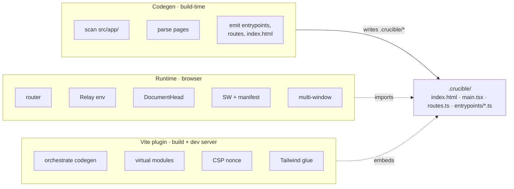
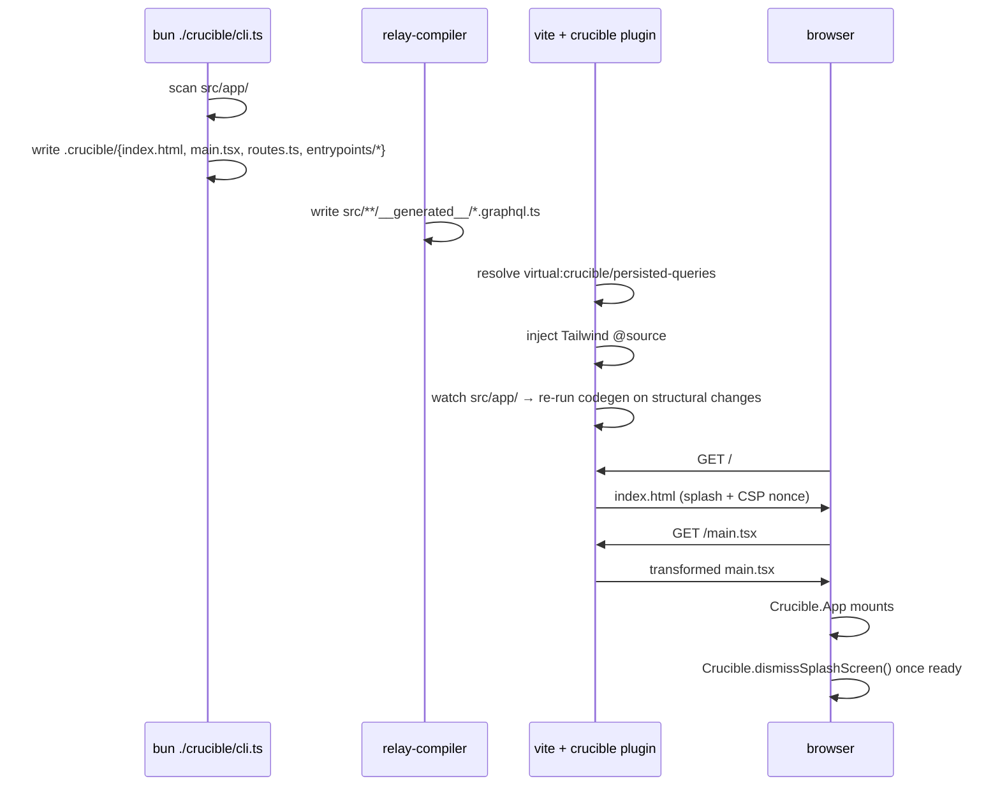

# Architecture

Crucible has three parts that talk to each other but evolve independently. Understanding their boundaries makes the rest of the docs easy to navigate.



**Heritage.** The route-entrypoint shape (preloadable queries fired in parallel with the route's chunk, declared via a `Queries` type on each `page.tsx`) follows [Pastoria](http://pastoria.org). The file-system conventions (layouts, parallel slots, intercepts, defaults, `metadata` exports, title templates) follow Next.js's `app/` directory. Crucible's contribution is to compose those well-trodden patterns into a small SPA-only runtime that ships with PWA + Electron polish out of the box.

## The three layers

### 1. Codegen (`crucible/codegen/`)

Reads the file system. Knows nothing about React.

- `scan.ts` — walks `src/app/`, classifies directories (`page`, `layout`, `[id]`, `@dialog`, `(.)foo`, etc.) into a tree of `DiscoveredRoute` records.
- `parse.ts` — opens each `page.tsx` with the TypeScript compiler API, extracts the `Queries` type alias, the `EntryPoints` declaration, and any `searchParams` schema export. Emits a `ParsedPage`.
- `emit.ts` — combines `DiscoveredRoute` + `ParsedPage` into `.crucible/entrypoints/*.ts`, `.crucible/routes.ts`, and `.crucible/registry.d.ts`. Each generated file is plain TypeScript that the runtime imports.
- `index-html.ts` — renders `src/app/splash.tsx` with `renderToStaticMarkup`, extracts `beforeCrucibleMount` callbacks via the TS AST, and writes `.crucible/index.html` with a fresh CSP nonce per build.
- `run.ts` — orchestrates the above. Run once per dev-server boot, once on every relevant file change, once per production build.

Key property: **codegen is incremental but not stateful.** Every run re-derives the whole `.crucible/` directory from `src/app/`. There's no cache, no stale-detection logic. Easy to reason about; cheap because the work is small.

### 2. Runtime (`crucible/runtime/`)

What ships in the browser bundle.

- `runtime/router/` — file-system routing, layered into 15 files (see [routing.md](./routing.md)). Pure helpers (`match`, `buckets`, `load`, `resolve`) are testable in isolation. The React surface (`app.tsx`, `outlet.tsx`, `page-renderer.tsx`) composes them.
- `runtime/entrypoint.ts` — `JSResource`: lazy module loader with promise dedup and error retry. The Suspense surface for code-splitting.
- `runtime/environment.ts` — Relay environment factory. `store-and-network` fetch policy, localStorage record cache keyed by the `schema.graphql` content hash so a backend schema change orphans stale records.
- `runtime/metadata.tsx` — `<DocumentHead>` and `mergeMetadata`. Imperatively updates `<meta>` tags (React 19's metadata hoisting doesn't dedupe by `name`, so we do it ourselves).
- `runtime/platform.ts` + `runtime/platforms/*` — `window.crucible` namespace. Web populates from the bundle; Electron preload populates from IPC. Same shape; the runtime branches on `runtime.type`.
- `runtime/link.tsx` — `<Link>` with prefetch-on-hover, scheme-safe href, same-origin click handling.
- `runtime/window.tsx` + `window-internal.ts` — `<Window>` and `openAppWindow()`. Pass-through on web; portal-into-popup on Electron, sharing the parent React tree.
- `runtime/url-safety.ts` — `isSafeHref` (XSS-safe rendering) and `isRouterTarget` (same-origin routing). The split is in [security.md](./security.md).

Key property: **the runtime imports nothing from `react-*`.** It's standalone TypeScript with peer deps on `react`, `react-dom`, `react-relay`, `relay-runtime`, `vite`, `graphql`, `react-error-boundary`. Open-source-bound by construction.

### 3. Vite plugin (`crucible/index.ts`)

The build-time + dev-server glue.

- Returns a Vite `Plugin` from `crucible({ appRoot, ... })`.
- `config()` — injects `import.meta.env.CRUCIBLE_*` constants (SW URL, manifest URL, schema hash) so the runtime reads them as build-time literals.
- `resolveId` / `load` — implements the `virtual:crucible/persisted-queries` virtual module. Reads `<appRoot>/persisted-queries.json` from the consumer's project, NOT from crucible's own directory.
- `buildStart` — fires codegen so `.crucible/` exists before Vite starts module resolution.
- `transform` — injects a Tailwind v4 `@source` directive into any CSS file that imports `tailwindcss`. Vite's `root` is `.crucible/`, which shrinks Tailwind's auto-content-scan window; the `@source` injection fixes it.
- `transformIndexHtml` — adds PWA meta-tag injections.
- `generateBundle` — emits the service worker (`sw.js`) into the build output, content-hashed by the build's emitted assets.
- `configureServer` — watches `src/app/` for structural changes and re-runs codegen.

Key property: **the plugin is the only piece that talks to the file system at request-time.** Codegen and the runtime are pure transforms; the plugin is where I/O happens.

## Lifecycle: `bun run dev`



The split is intentional: relay-compiler and Crucible's codegen are separate processes that share `src/app/` but don't depend on each other. Either can run alone for debugging.

## Lifecycle: `bun run build`

```mermaid
flowchart LR
  relay[relay-compiler] --> tsc[tsc -b · type-check no emit]
  tsc --> codegen[crucible cli.ts · fresh codegen]
  codegen --> vite[vite build → .crucible/build/web/]
  vite --> electron[(optional)<br/>electron-builder]
```

`vite build` runs rollup on `.crucible/main.tsx` as the entry, tree-shakes, emits hashed asset chunks, and the plugin's `generateBundle` hook writes `sw.js` with the final asset list.

## Lifecycle: a navigation

```mermaid
sequenceDiagram
  participant User
  participant Link as link.tsx
  participant App as router/app.tsx
  participant URL as url-safety
  participant Scroll as router/scroll.ts
  participant Resolve as router/resolve.ts
  participant Match as router/match.ts
  participant Load as router/load.ts
  participant VT as view-transitions
  participant React

  User->>Link: click <Link to="/orders/123">
  Link->>App: navigate("/orders/123")
  App->>URL: assertRouterTarget(to)
  App->>Scroll: scrollBehavior.save()
  App->>Resolve: resolveAndLoad(buckets, location, "soft", env, prev)
  Resolve->>Match: matchRoute(...)
  Resolve->>Load: loadEntrypoint(...) [loadQuery + JSResource.load]
  Resolve-->>App: Resolution
  App->>VT: withViewTransition(commit)
  VT->>React: history.pushState + setState
  React->>App: commit
  App->>Scroll: useLayoutEffect → scrollBehavior.apply
  App->>App: useEffect → focusBehavior.apply
  App->>App: useEffect → onResolve?.(...)
```

Every phase is a small, named function in its own file. Each is testable in isolation. The orchestration in `app.tsx` is thin — it wires phases to React lifecycle hooks.

## Strategy props

`<App>` takes typed strategy props for every replaceable phase:

| Prop | Type | Default | Purpose |
|---|---|---|---|
| `matcher` | `MatchFn` | `matchRoute` | URL pathname → match. Replace for locale prefixes, case-insensitive routes, etc. |
| `scrollBehavior` | `ScrollBehavior` | `defaultScrollBehavior` | `save()` + `apply(location, source)`. Replace for animated scroll, offset for sticky headers, etc. |
| `focusBehavior` | `FocusBehavior` | `defaultFocusBehavior` | `apply()` post-nav. Replace for custom focus targeting. |
| `onError` | `(err, info) => void` | none | Wire to Sentry/Datadog. Fires for both top-level + per-frame error boundaries. |
| `onNavigate` | `(event) => void` | none | Pre-resolve hook. `event = { from, to, source, startedAt }`. `startedAt` is `performance.now()` when navigate fired — pair with `onResolve` for nav-latency RUM. |
| `onResolve` | `(event) => void` | none | Post-commit hook. `event = { location, resolution, startedAt, resolvedAt, durationMs }`. `durationMs = resolvedAt - startedAt`; feed into a p50/p95 histogram. |
| `viewTransitions` | `boolean` | `true` | Wrap state changes in `document.startViewTransition` when supported. |
| `restoreScroll` | `boolean` | `true` | Toggle the scroll restoration phase. |
| `manageFocus` | `boolean` | `true` | Toggle the focus phase. |

The Relay environment has a parallel seam at the construction site: `createEnvironment({ fetch?: FetchLike })` accepts a custom fetch so apps can inject request-scoped headers (idempotency keys, telemetry IDs) without monkey-patching `globalThis.fetch`. The codegen-emitted `.crucible/main.tsx` imports `network` from `src/app/crucible.config.ts` (when present) and threads `network.fetch` through. See [data-loading.md → "Custom fetch"](./data-loading.md#custom-fetch).

These are not a plugin system. They are typed function props. Compose by writing higher-order strategies:

```ts
const trackingScroll: ScrollBehavior = {
  save: () => { defaultScrollBehavior.save(); track("scroll-save"); },
  apply: (loc, src) => { defaultScrollBehavior.apply(loc, src); track("scroll-apply", loc, src); },
};

<App scrollBehavior={trackingScroll} ... />
```

## Why this shape

- **Pure helpers in their own files.** Test in isolation, no React scaffolding. The router's `match.ts` has 100% coverage with 30 lines of test fixtures.
- **React surface as orchestration only.** `app.tsx` is 280 lines but mostly hooks-around-state. It does not implement matching, loading, scrolling, or focus — it composes the units that do.
- **Strategy props instead of monads or DI.** Replaceability without taxonomy. A new contributor reads three files (`app.tsx`, `scroll.ts`, `focus.ts`) and understands the whole story.
- **No global state outside React.** Every cross-cutting concern lives in a context, a hook, or a registry that's mounted by `<App>` or `<AppShell>`. The `windowRegistry` is the one exception (necessary because imperative `openAppWindow()` needs module-level state) and it's covered by `useSyncExternalStore`'s contract.

## What's not in the runtime

By design:

- **No router middleware system.** Use strategy props; that's the seam.
- **No data fetching beyond Relay.** The plumbing is generic enough that swapping in another GraphQL client is doable, but Crucible doesn't pretend to abstract over it. Pick one.
- **No SSR.** Hard limit. SSR is what we're avoiding by not using Next.js.
- **No state-management library opinion.** React state, Relay store, Zustand if you want — Crucible doesn't care.
- **No CSS-in-JS opinion.** Tailwind ships with the plugin's `@source` injection because we use it; you can rip that out and use anything else.

## Reading order

If you're new:
1. This file.
2. [`routing.md`](./routing.md) — the heaviest convention.
3. [`data-loading.md`](./data-loading.md) — how queries get to your component.
4. [`metadata.md`](./metadata.md) — `<DocumentHead>` and `Crucible.Metadata`.
5. [`security.md`](./security.md) — what's enforced, what's your job.

The rest are reference: [`codegen.md`](./codegen.md), [`vite-plugin.md`](./vite-plugin.md), [`electron.md`](./electron.md), [`pwa.md`](./pwa.md).
