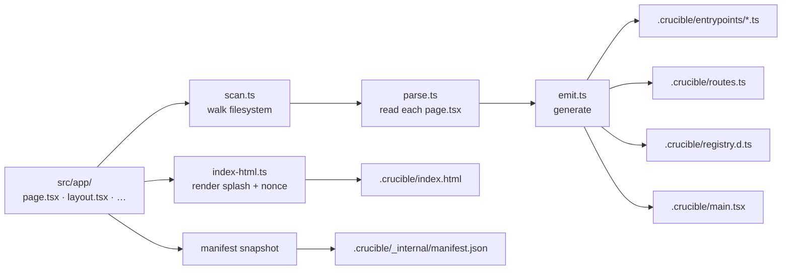

# Codegen

Codegen turns `src/app/` into typed TypeScript that the runtime imports. It's not magic; this doc walks through what each phase does and what files it produces.



## When it runs

| Trigger | What runs |
|---|---|
| `bun run codegen:crucible` (CLI) | Full codegen: scan, parse, emit all artifacts. |
| `bun run codegen` (Crucible's pipeline) | Schema → preflight → relay-compiler → crucible. |
| Vite dev server boot | Plugin `buildStart` hook fires `runCodegen()` once. |
| Structural file change in `src/app/` (add/remove `.ts/.tsx/.graphql`) | Plugin watcher fires `runCodegen()` and a full Vite reload. |
| Content change inside an existing file | No codegen — Vite's HMR + Fast Refresh handle the update. |

The split between "structural" (re-codegen) and "content" (HMR-only) lets you edit a page's body and see it update instantly, while adding a new file regenerates the route table.

## Phase 1: scan (`scan.ts`)

Walks `src/app/` recursively. For each directory:

1. Classify the directory name:
   - `[id]` → `param` segment
   - `[...path]` → `catchall` segment
   - `(group)` → invisible (not a URL segment)
   - `@dialog` → parallel slot (or any `@<name>` — the directory name becomes the slot prop name on the parent layout)
   - `(.)foo`, `(..)foo`, `(...)foo` → intercept route (kind preserved as a tag)
   - anything else → literal segment
2. Collect frame files at this level: `layout.tsx`, `loading.tsx`, `error.tsx`, `not-found.tsx`.
3. If `page.tsx` exists, emit a `DiscoveredRoute` of kind `"page"`.
4. If `default.tsx` exists, emit a `DiscoveredRoute` of kind `"default"`.
5. Recurse into subdirectories (skipping `_*` underscore-prefixed and `@*` slot subtrees, which are walked separately).

Output: a flat array of `DiscoveredRoute`. Each carries:
- `urlPath` — the URL it matches
- `id` — a stable string ID (used for chunk naming + entrypoint file names)
- `segments` — the parsed path
- `pageFile` — the source `.tsx` to import
- `frames` — the layout/loading/error/notfound chain from root to this directory
- `slot`, `intercept`, `kind` — classification flags

## Phase 2: parse (`parse.ts`)

For each discovered page, opens the file with the TypeScript compiler API and extracts:

- The `Queries` type alias declaration. From `export type Queries = { home: HomeQuery }`, parse out the field names + the artifact type each refers to + the artifact's path on disk.
- The `EntryPoints` type alias (if present). From `export type EntryPoints = { sidebar: typeof import("./_sidebar.tsx") }`, parse the field names + module paths.
- The `searchParams` export (if present). Note: only its presence is detected here; the schema runs at runtime.
- For each query, the `variables` declaration in its GraphQL operation, parsed from the source file's `graphql\`...\`` template literals.

Output: a `ParsedPage` per page. The next phase combines `DiscoveredRoute + ParsedPage` to emit code.

## Phase 3: emit (`emit.ts`)

Three artifacts per scan:

### `.crucible/entrypoints/<id>.ts`

One per route. Imports the page's GraphQL artifact files, declares the `Queries` shape, builds an `EntryPoint` object that maps URL params to query variables. Looks like:

```ts
import { JSResource, type EntryPoint } from "react-crucible/runtime/entrypoint.ts";
import query0 from "../../src/app/orders/[id]/__generated__/OrderDetailQuery.graphql.ts";
import type { OrderDetailQuery } from "../../src/app/orders/[id]/__generated__/OrderDetailQuery.graphql.ts";

type Queries = {
  order: { parameters: typeof query0; variables: OrderDetailQuery["variables"] };
};

const entrypoint: EntryPoint<Queries> = {
  root: JSResource("orders.[id]", () =>
    import("../../src/app/orders/[id]/page.tsx") as Promise<…>,
  ),
  getPreloadProps: ({ params }) => ({
    queries: {
      order: { parameters: query0, variables: { id: params.id } },
    },
  }),
};

export default entrypoint;
```

Variables binding: when the page's URL has a `[name]` segment AND the query declares a `$name` variable, codegen wires them together. Mismatched names go unbound.

Sub-entrypoints (declared via `EntryPoints` type) are emitted as separate files in the same directory, recursively.

### `.crucible/routes.ts`

The route manifest. Imports every entrypoint, builds a `RouteRecord[]` the runtime consumes:

```ts
import { JSResource } from "react-crucible/runtime/entrypoint.ts";
import type { RouteRecord } from "react-crucible/runtime/router/types.ts";
import type { Metadata } from "react-crucible/runtime/metadata.tsx";
import ep_orders___id_ from "./entrypoints/orders.[id].ts";

const layout0 = JSResource("layout0", () => import("../src/app/orders/layout.tsx") as Promise<…>);
import loading0 from "../src/app/orders/loading.tsx";

export const routes: ReadonlyArray<RouteRecord> = [
  {
    path: "/orders/[id]",
    segments: [
      { kind: "literal", value: "orders" },
      { kind: "param", name: "id" },
    ],
    frames: [
      { layout: layout0, loading: loading0 },
    ],
    entrypoint: ep_orders___id_,
  },
  …
];
```

Layouts are wrapped in `JSResource` (lazy — split into the page's chunk). Loading/error/not-found components are imported eagerly because their boundary fallbacks must render synchronously when their boundary fires.

### `.crucible/registry.d.ts`

A `declare module "crucible" { interface RouteRegistry { … } }` augmentation. Maps each URL literal to its `params`, `queries`, and (optionally) `searchParams` shapes. This is what makes `Crucible.PageProps<"/orders/[id]">` infer to `{ params: { id: string }; queries: { order: PreloadedQuery<OrderDetailQuery>; }; … }`.

The user authors `Crucible.PageProps<"/orders/[id]">` by URL literal; codegen ensures the type system knows the shape. New page → new registry entry; deleted page → registry entry removed; renamed param → updated.

## Phase 4: main.tsx (`emit.ts`)

```ts
import { StrictMode } from "react";
import { createRoot } from "react-dom/client";
import * as Crucible from "crucible";
import { routes } from "./routes.ts";

const environment = Crucible.createEnvironment();

createRoot(document.getElementById("root")!).render(
  <StrictMode>
    <Crucible.AppShell>
      <Crucible.App routes={routes} environment={environment} />
    </Crucible.AppShell>
  </StrictMode>,
);
```

Unconditional. The user doesn't write this. Vite uses it as the dev/build entry.

## Phase 5: index.html (`index-html.ts`)

The most complex phase. Steps:

1. Generate a fresh CSP nonce (16 random bytes, base64).
2. If `src/app/splash.tsx` exists:
   a. Dynamic-import the file (under Bun, with codegen globals stubbed so `beforeCrucibleMount(...)` doesn't ReferenceError).
   b. Render the default-exported component to static HTML via `renderToStaticMarkup`.
   c. Re-parse the file with the TS AST and extract every top-level `beforeCrucibleMount(callback)` snippet.
   d. TS-strip each snippet via Bun's transpiler so the inline `<script>` is plain JS.
3. Read root layout's `metadata` export (regex-only, doesn't import) for `title` and `themeColor` defaults — those are baked into the static `<meta>` tags so the OS chrome doesn't flash a different color at boot.
4. Build the CSP string with the nonce, omitting `'unsafe-inline'` from `script-src`.
5. Stamp the nonce on every inline `<script>` and `<style>` we control + on the `<script type="module" src="./main.tsx">` boot tag.
6. Write the result to `.crucible/index.html`.

The file is regenerated on every codegen run, so structural changes (new splash, new layout title) propagate automatically.

## Phase 6: manifest snapshot (`run.ts`)

`src/app/manifest.ts` (if present) is dynamic-imported at codegen time and its resolved value is written to `.crucible/_internal/manifest.json`. The Vite plugin reads this JSON synchronously at runtime — so the plugin doesn't need to import `.ts` files at non-Bun runtimes.

The plugin uses the resolved manifest to:
- Inject `<link rel="manifest" href="/manifest.webmanifest">` into the HTML
- Emit the manifest itself at `/manifest.webmanifest` for browsers and the SW

## Output directory

```
apps/<your-app>/.crucible/
├── _internal/
│   └── manifest.json              ← snapshot of src/app/manifest.ts (resolved)
├── entrypoints/
│   ├── index.ts                   ← per-route entrypoint
│   ├── orders.[id].ts
│   └── …
├── index.html                     ← splash + CSP + boot
├── main.tsx                       ← createRoot + AppShell + App
├── registry.d.ts                  ← typed RouteRegistry augmentation
└── routes.ts                      ← RouteRecord[] for the runtime
```

`.crucible/` is `.gitignore`d. It's regenerated on every codegen run.

## Customizing the import specifier

By default, generated code imports from `react-crucible/...`. If you publish or alias the package under a different name:

```ts
// vite.config.ts
crucible({ crucibleSpecifier: "crucible" })
```

Generated entrypoints will then `import { JSResource } from "crucible/runtime/entrypoint.ts"` instead. Useful for open-sourcing later or for monorepos that alias the package locally.

## Limitations + sharp edges

- **Symlinks confuse the scanner.** It walks via `readdirSync` + `statSync`. Symlinked directories under `src/app/` aren't followed.
- **`.ts` and `.tsx` only.** No CommonJS, no `.mjs`, no `.jsx`.
- **The TS AST parse is best-effort.** It looks for the literal patterns `export type Queries = {...}` and `export type EntryPoints = {...}`. Computed types or type aliases that re-export from another file aren't followed.
- **Codegen is synchronous and single-threaded.** A 10,000-route app will take noticeable time. Crucible's app is in the dozens; this hasn't been a constraint.
- **No incremental codegen.** Every run scans everything. The work is small enough that it doesn't matter; if it ever does, this is where you'd add a cache.
