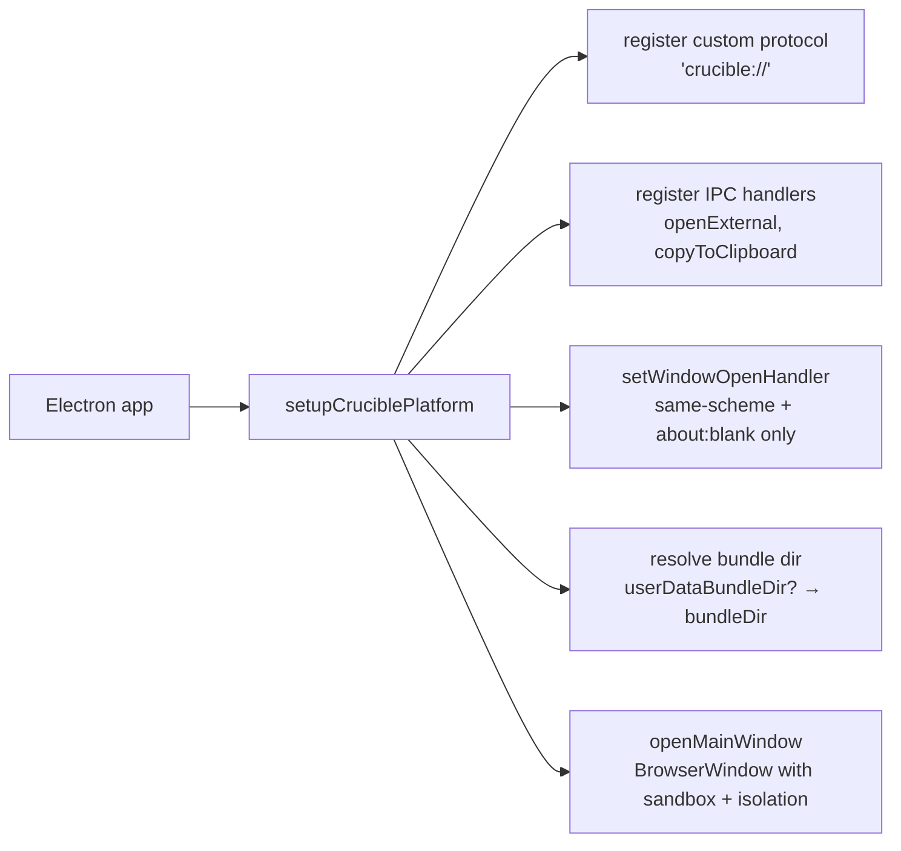

# Electron

Crucible ships an Electron integration that runs the same SPA bundle as a desktop app, with a typed IPC contract for the platform-specific bits (clipboard, opening external links, multi-window).

## Setup

Two files in your app's `desktop/` directory:

```ts
// desktop/main.ts
import { app, BrowserWindow } from "electron";
import { setupCruciblePlatform } from "react-crucible/electron";
import { join } from "node:path";

const platform = setupCruciblePlatform({
  bundleDir: join(__dirname, "../bundle"),
  preloadPath: join(__dirname, "preload.js"),
  // Optional: hot-update overlay path. If exists with index.html, wins
  // over bundleDir.
  userDataBundleDir: join(app.getPath("userData"), "bundles", "current"),
});

platform.registerProtocolSchemes();
app.whenReady().then(() => platform.openMainWindow());
```

```ts
// desktop/preload.ts
import { setupCruciblePreload } from "react-crucible/electron/preload";
setupCruciblePreload();
```

That's the integration. From here, the same React app that runs in the browser runs as a desktop app — same routes, same Relay environment, same components.

## What `setupCruciblePlatform` does



### 1. Custom protocol scheme

Production renderers load `crucible://app/`. The protocol handler reads files from `bundleDir` and serves them. This avoids `file://` (which has weak origin guarantees) and avoids running a local HTTP server (which is overkill for serving a static bundle).

When `CRUCIBLE_DEV_URL` is set (or `devUrl` is passed to `setupCruciblePlatform`), the renderer loads the dev URL directly instead of going through the protocol — that's how `bun run desktop:dev` wires the renderer to Vite's dev server with HMR.

### 2. IPC handlers

`ipcMain.handle()` is registered for a closed set of channels:

| Channel | Receives | Returns |
|---|---|---|
| `openExternal` | URL string | `boolean` (true on success) |
| `copyToClipboard` | text string | `boolean` |

Each handler validates the input. `openExternal` rejects anything that isn't `^https?:|^mailto:|^tel:`. The renderer can't reach `ipcRenderer.invoke(...)` directly (see preload below), so the only way to call these is through the typed `window.crucible.openExternal(url)` etc.

### 3. Window open handler

`setWindowOpenHandler` restricts what `window.open(...)` from the renderer can target:

| Target URL | Action |
|---|---|
| `about:blank` | allow (used by the multi-window portal pattern) |
| `crucible://*` | allow |
| `<devUrl>*` (when in dev) | allow |
| anything else | **deny** |

Allowed popups inherit the same preload + `contextIsolation: true, nodeIntegration: false, sandbox: true`. So `window.crucible` is populated correctly in popups too.

### 4. BrowserWindow defaults

- `contextIsolation: true`
- `nodeIntegration: false`
- `sandbox: true`
- `titleBarStyle: "hiddenInset"` on macOS (transparent title bar with traffic lights)
- Configured size + min size from `window` option (defaults: 1280×800, min 720×480)

## What `setupCruciblePreload` does

The preload script's only job is to expose a typed `window.crucible` namespace via `contextBridge`:

```ts
contextBridge.exposeInMainWorld("crucible", {
  runtime: { type: "electron", capabilities: ["CLIPBOARD", "EXTERNAL_LINKS"] },
  openExternal: (url) => ipcRenderer.invoke(CHANNELS.openExternal, url),
  copyToClipboard: (text) => ipcRenderer.invoke(CHANNELS.copyToClipboard, text),
});
```

The renderer receives **only the bound methods**. It cannot reach `ipcRenderer.invoke(channel, …)` directly. So even if a stored XSS lands in the renderer, it can't reach IPC channels the main process didn't intend to expose.

## Same shape on web

The web bootstrap installs an equivalent runtime via `installWebRuntime()`:

```ts
{
  runtime: { type: "web", capabilities: ["CLIPBOARD", "EXTERNAL_LINKS", "NOTIFICATIONS"] },
  openExternal: async (url) => {
    if (!isSafeHref(url)) return false;
    return window.open(url, "_blank", "noopener,noreferrer") !== null;
  },
  copyToClipboard: async (text) => {
    await navigator.clipboard.writeText(text);
    return true;
  },
}
```

Same `CrucibleRuntime` shape; the implementation differs. Components consume via the `usePlatform()` hook:

```tsx
import * as Crucible from "crucible";

function ShareButton({ url }: { url: string }) {
  const platform = Crucible.usePlatform();
  return (
    <button onClick={() => platform.openExternal(url)}>
      Open externally
    </button>
  );
}
```

That code runs identically in web and Electron. The platform layer dispatches.

For platform-specific UI (e.g. native window controls only on Electron):

```tsx
import { isElectron } from "crucible";

return isElectron() ? <NativeTrafficLights /> : <WebCloseButton />;
```

## Multi-window

Two ways to open extra windows. Both share the parent React tree (Relay env, navigation, theme).

### Declarative: `<Window>`

```tsx
import * as Crucible from "crucible";

function App() {
  const [showInspector, setShowInspector] = useState(false);
  return (
    <>
      <button onClick={() => setShowInspector(true)}>Open inspector</button>
      {showInspector && (
        <Crucible.Window
          title="Inspector"
          width={500}
          onClose={() => setShowInspector(false)}
        >
          <InspectorPanel />  {/* renders inside a separate native window */}
        </Crucible.Window>
      )}
    </>
  );
}
```

On web, `<Window>` is a pass-through (children render inline). On Electron, it opens a popup via `window.open("about:blank")`, sets up the Electron portal, mirrors stylesheets, and renders children there.

### Imperative: `Crucible.openAppWindow(...)`

For when you need to open a window from an event handler that isn't naturally tied to declarative state:

```tsx
import * as Crucible from "crucible";

const handle = Crucible.openAppWindow(
  <CsvPreview rows={SAMPLE_ROWS} />,
  { title: "CSV preview", width: 700 },
);

// later:
handle.close();
```

`<WindowsHost>` (mounted once by `<Crucible.App>`) listens to a module-level registry and renders these via portals. Same React tree, same context. Snapshot at call time (the children prop is captured when you invoke `openAppWindow`, not reactive).

## Stylesheet mirroring

Popup windows have their own `document` — they don't inherit the parent's stylesheets. Crucible's `observeStyleChanges` cloning logic mirrors all `<style>` and `<link rel="stylesheet">` from the parent into the popup, and re-syncs on add/remove (so HMR works in popups).

The MutationObserver is narrow: it watches `document.head` for STYLE/LINK childList changes only. It does NOT watch character data or attribute mutations — those happen constantly during navigation (e.g., DocumentHead updating `<meta content>`) and would force a full stylesheet re-clone per navigation, thrashing the popup.

## Building a desktop binary

```bash
bun run build              # produces .crucible/build/web/ (the renderer bundle)
bun run desktop:bundle     # bundles desktop/main.ts + preload.ts to desktop/dist/
bun run desktop:package    # electron-builder reads desktop/electron-builder.yml
```

The renderer bundle ships unchanged from web. The desktop binary is just a thin shell around it.

## Auth flows

A common pain point. The renderer process can't trivially complete OAuth flows that need browser cookies. Two patterns work:

### Browser-tab OAuth + deep link

1. Click "Sign in" → main process opens `https://auth.example.com/...` via `shell.openExternal`.
2. After auth, the OAuth provider redirects to `myapp://oauth-callback?token=...` (a custom URL scheme registered with the OS).
3. The OS launches/focuses the Electron app with that URL.
4. Main process receives `app.on("open-url")` (macOS) or `app.on("second-instance")` with the URL (Windows/Linux).
5. Main process completes the token exchange + writes the session to disk via `safeStorage`.
6. Renderer reads the session via an IPC bridge.

Requires registering the URL scheme in `app.setAsDefaultProtocolClient(...)` and handling the launch event. Out of scope for crucible, but compatible — `setupCruciblePlatform` doesn't interfere.

### Cookie-based session in the renderer

If your auth uses cookies on the same origin, run a "splash" route that gates on auth state. The IPC bridge surfaces an `authenticated` event that the renderer listens to without polling. Wire the same gate into your app's `desktop/main.ts`.

## Sharp edges

- **The preload path must be absolute.** Relative paths to `webPreferences.preload` silently fail with no preload running.
- **`sandbox: true` blocks Node.js APIs in the preload.** That's the point — but it means you can't `require("fs")` in `preload.ts`. Use IPC for filesystem work.
- **Hot updates require a separate `userDataBundleDir`.** The `bundleDir` shipped with the binary is read-only on macOS. Apps that want delta updates write the new bundle to `userData/bundles/current/` and restart.
- **Custom protocol schemes need to be registered BEFORE `app.whenReady()`.** That's what `platform.registerProtocolSchemes()` is for. Calling it after `whenReady` no-ops silently.

## What `setupCruciblePlatform` does NOT do

- **No auto-update.** Bring `electron-updater` (or your own) and call its API after `openMainWindow()`.
- **No menu bar / context menu.** Bring `Menu.buildFromTemplate(...)` yourself.
- **No tray icon.** Same.
- **No system notifications.** Bring `new Notification(...)`.
- **No window state persistence.** Bring `electron-window-state` if you want windows to remember position/size.

These are deliberately out of scope. Crucible owns the renderer + the IPC contract; the rest of Electron's surface is yours.
