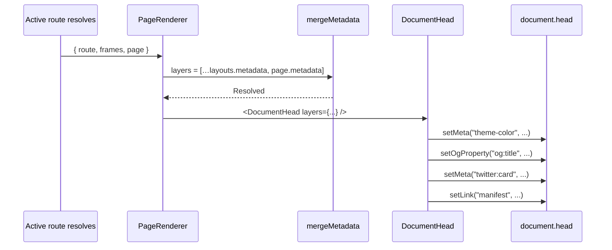

# Metadata

Each layout and page can export a `metadata` object. Crucible merges them outer-to-inner and writes the result to `<head>` imperatively after every navigation. The Metadata API is modeled after Next.js's `metadata` export.

## The shape

```ts
export type Metadata = {
  title?: string | TitleTemplate;
  description?: string;
  themeColor?: HexColor;
  backgroundColor?: HexColor;
  statusBarStyle?: AppleStatusBarStyle;
  appleTitle?: string;
  manifest?: string | false;
  appleTouchIcon?: string;
  openGraph?: OpenGraph;
  twitter?: Twitter;
  robots?: string | boolean;
  other?: ReadonlyArray<{ name: string; content: string }>;
};

export type TitleTemplate = {
  template: `${string}%s${string}`;
  default: string;
};

export type OpenGraph = {
  title?: string;
  description?: string;
  image?: string;
  type?: string; // "website" | "article" | …
  url?: string;
  siteName?: string;
  locale?: string;
};

export type Twitter = {
  card?: "summary" | "summary_large_image" | "app" | "player";
  site?: string;        // @handle
  creator?: string;     // @handle
  title?: string;
  description?: string;
  image?: string;
};
```

## Title resolution

`title` can be a string OR a `TitleTemplate`. Title resolution walks layers outermost → innermost:

| Layer's title | Effect |
|---|---|
| `string` | Sets the slot text. |
| `TitleTemplate` | Becomes the active template. |
| `undefined` | Inherits from outer layer. |

At the end, if a template was set, the active slot text fills its `%s`. Otherwise the slot text is used directly.

```ts
// src/app/layout.tsx
export const metadata: Metadata = {
  title: { template: "%s · Crucible", default: "Welcome" },
};

// src/app/orders/page.tsx
export const metadata: Metadata = {
  title: "Orders",
};
```

Resulting `<title>`: `Orders · Crucible`.

If the page has no `title` export, `<title>` becomes `Welcome · Crucible` (the template's `default` fills its own slot).

If the page sets `title: { template: "%s — Mobile", default: "Page" }`, the inner template wins and the title is rendered without the outer template applied.

## Theme color and PWA chrome

```ts
export const metadata: Metadata = {
  themeColor: "#1a1a1a",            // <meta name="theme-color">
  backgroundColor: "#1a1a1a",       // splash bg, OS chrome bg
  statusBarStyle: "black-translucent",  // iOS PWA status bar
  appleTitle: "Crucible",            // installed-PWA title on iOS home screen
  appleTouchIcon: "/icons/touch.png",
  manifest: "/manifest.webmanifest", // false to disable
};
```

These are **per-route** — a marketing layout can have a light theme, the app layout can have dark. The OS chrome updates as the user navigates.

## Open Graph and Twitter

```ts
export const metadata: Metadata = {
  openGraph: {
    title: "Order #123",
    description: "1.5 kg of fine gold for John Smith.",
    image: "/og/orders/123.png",
    type: "website",
    siteName: "Crucible",
  },
  twitter: {
    card: "summary_large_image",
    site: "@Crucible",
    title: "Order #123",
    image: "/og/orders/123.png",
  },
};
```

OG uses `<meta property="og:foo">`; Twitter uses `<meta name="twitter:foo">`. Crucible writes both correctly. Layers shallow-merge — the page's `openGraph.image` wins, but `openGraph.siteName` from the layout still applies.

## Robots

```ts
export const metadata: Metadata = {
  robots: false,                      // → "noindex, nofollow"
  // robots: true,                    // → "index, follow"
  // robots: "noindex, max-snippet:-1", // verbatim
};
```

The boolean shortcut covers the common case. Use the string form for fine control.

## Anything else: `other`

The escape hatch. Each entry becomes `<meta name="X" content="Y">`:

```ts
export const metadata: Metadata = {
  other: [
    { name: "msapplication-TileColor", content: "#1a1a1a" },
    { name: "format-detection", content: "telephone=no" },
  ],
};
```

Use it sparingly. Prefer typed fields (`themeColor`, `openGraph`, etc.) when one exists — it's clearer at the call site and catches typos.

## Default values (AppShell)

`<AppShell>` (mounted by codegen-emitted `main.tsx`) provides defaults for every per-route Metadata field:

```tsx
<Crucible.AppShell
  defaultTitle={{ template: "%s · Crucible", default: "Welcome" }}
  themeColor="#ffffff"
  backgroundColor="#ffffff"
  statusBarStyle="default"
  manifest="/manifest.webmanifest"
>
  <Crucible.App routes={routes} environment={environment} />
</Crucible.AppShell>
```

Every layout's `metadata` overrides these. The page's `metadata` overrides the layouts'. Layout metadata is inherited by sibling routes that don't declare their own.

You usually don't author `<AppShell>` directly — codegen generates `main.tsx` to mount it. Override defaults via the **root layout's** `metadata` export:

```ts
// src/app/layout.tsx
export const metadata: Metadata = {
  title: { template: "%s · MyApp", default: "Welcome" },
  themeColor: "#1a1a1a",
};
```

Codegen reads this at build time to seed `index.html`'s static `<meta>` tags so the OS chrome doesn't flash a different color before React mounts.

## How the runtime applies metadata



The runtime mutates existing `<meta>` tags imperatively rather than rendering React elements, because React 19's `<meta>` hoisting doesn't dedupe by `name` — two `<meta name="theme-color">` with different content would both end up in `<head>`. We keep one tag per name across navigations.

## What you should NOT do

**Don't render your own `<title>` or `<meta>` tags inside page components.** Use the `metadata` export. Mixing the two means the imperative DocumentHead and the React tree fight over `<head>`.

**Don't put dynamic data in metadata that needs query results.** The `metadata` export is read synchronously at render time from the page module's static export — it can't await query results. If you need data-driven metadata (e.g. order title from server), set it inside the component:

```tsx
import { useEffect } from "react";

export default function OrderPage({ queries }: …) {
  const data = usePreloadedQuery(...);
  useEffect(() => {
    document.title = `Order #${data.order.id}`;
  }, [data.order.id]);
  return …;
}
```

Less elegant, but it's what's possible without server rendering.

## Common patterns

### Landing pages with full OG cards

```ts
// src/app/(marketing)/about/page.tsx
export const metadata: Metadata = {
  title: "About",
  description: "What Crucible does and why.",
  openGraph: {
    title: "About Crucible",
    description: "What Crucible does and why.",
    image: "/og/about.png",
    type: "website",
  },
  twitter: { card: "summary_large_image", site: "@Crucible" },
};
```

### Internal-only pages (no indexing)

```ts
// src/app/(app)/layout.tsx
export const metadata: Metadata = {
  robots: false,                    // applies to everything under (app)/
};
```

### Per-tab title in a tabbed view

```tsx
// src/app/orders/[id]/layout.tsx
export const metadata: Metadata = {
  title: { template: "Order — %s", default: "Overview" },
};

// src/app/orders/[id]/page.tsx
export const metadata: Metadata = { title: "Overview" };

// src/app/orders/[id]/activity/page.tsx
export const metadata: Metadata = { title: "Activity" };
```

`<title>` becomes `Order — Overview` then `Order — Activity` as the user switches tabs.
