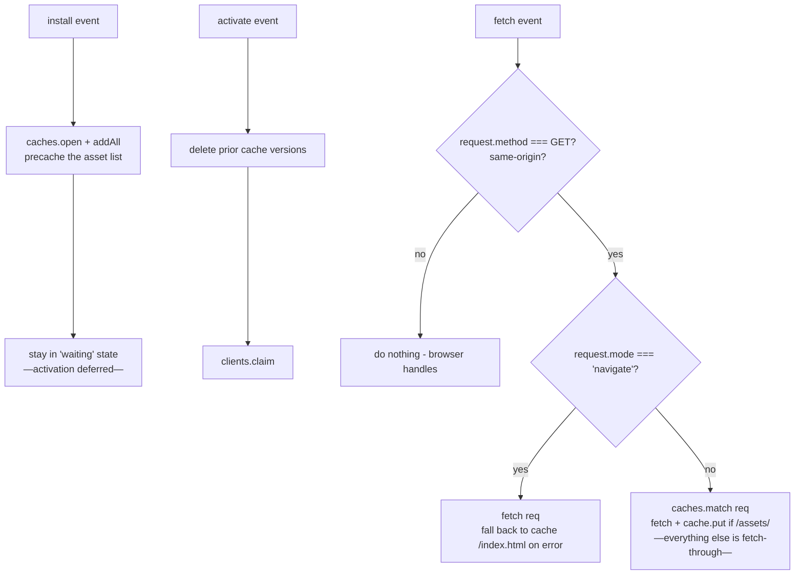

# PWA

Crucible ships a Progressive Web App pipeline: typed manifest authoring, content-hashed service worker, splash painted before any JS parses. This doc walks through what's there and how to use it.

## The manifest

Author `src/app/manifest.ts`:

```ts
export default defineManifest({
  name: "Crucible",
  shortName: "Crucible",
  description: "A Crucible application.",
  themeColor: "#1a1a1a",
  backgroundColor: "#1a1a1a",
  display: "standalone",
  startUrl: "/",
  scope: "/",
  orientation: "any",
  categories: ["finance"],
  icons: [
    { src: "/icons/192.png", sizes: "192x192", type: "image/png" },
    { src: "/icons/512.png", sizes: "512x512", type: "image/png" },
    { src: "/icons/maskable.png", sizes: "512x512", type: "image/png", purpose: "maskable" },
  ],
  appleTouchIcon: "/icons/apple-touch.png",
});
```

`defineManifest` is a global ambient — no import needed (declared in `crucible-env.d.ts`). It's an identity function; the real value of using it is type-checking against the `Manifest` type.

The default export can be the manifest object directly OR a function returning one (sync or async — codegen awaits).

At codegen time, the file is dynamic-imported, the resolved value is written to `.crucible/_internal/manifest.json`, and the Vite plugin emits it at `/manifest.webmanifest`.

## Splash

Author `src/app/splash.tsx`:

```tsx
export default function Splash() {
  return (
    <div style={{
      display: "grid",
      placeItems: "center",
      height: "100dvh",
      backgroundColor: "#1a1a1a",
    }}>
      
    </div>
  );
}

beforeCrucibleMount(() => {
  // Inline JS that runs as soon as the browser parses index.html —
  // before any bundle loads. Use it to:
  //   - Hide the splash early on hot-reload (when React mounts fast)
  //   - Read a session-pending hint from the URL and show a different message
  //   - Block on iOS PWA workarounds
});
```

Two things happen at codegen time:

1. The default export is rendered to static HTML via `renderToStaticMarkup` and inlined into `index.html` inside `<div id="crucible-splash">`.
2. Every top-level `beforeCrucibleMount(callback)` call is extracted via the TS AST, transpiled to plain JS via Bun, and inlined as `<script nonce="...">...</script>`.

Result: the splash paints **before any JS bundle parses**. On a slow connection, the user sees the splash within 100ms of TTFB, even when the main bundle takes seconds.

After React mounts:

```ts
import * as Crucible from "crucible";

function App() {
  useEffect(() => {
    if (auth.ready) Crucible.dismissSplashScreen();
  }, [auth.ready]);
  // …
}
```

`dismissSplashScreen()` dispatches a `crucible:mounted` event. The default `beforeCrucibleMount` listener (used when you don't author your own) toggles the `crucible-splash-hidden` class, which triggers a CSS opacity transition (220ms ease-out). After the transition ends, the splash element is removed from the DOM.

If you authored your own `beforeCrucibleMount`, the default listener doesn't run — you're responsible for the dismiss logic. Most apps just keep the default.

## Service worker

`runtime/sw.ts` generates the service worker source at build time. The Vite plugin's `generateBundle` hook embeds the asset list and a content-derived version, then emits `/sw.js`.

Strategy:



### Navigation requests (`mode === "navigate"`)

Network-first. If the network responds, use it. If not, fall back to the cached `/index.html` (the SPA shell). The shell then loads chunks from cache, so the app boots fully offline if the chunks are also cached.

### Asset requests (everything else)

Cache-first for `/assets/*` (Vite's content-hashed bundle directory; URLs are immutable for a given filename, so cache-first is safe and storage growth is bounded). Other same-origin GETs are still fetched, but **not** stored — dynamic responses (API calls, user-uploaded files, generated reports) would otherwise grow the cache without bound until the next version flush. This filter is part of the SW template; consumer apps don't configure it.

### Versioning

The cache name is `crucible-<version>` where `version` is an FNV-1a hash of the emitted asset list (filename + size). New build → new hash → new cache → old caches purged on `activate`.

This means the SW serves the new asset set as soon as the new build deploys, with no manual version bumping.

### Update flow

When a new SW is detected, Crucible **does not activate it immediately**. Instead it lands in the `waiting` state and the runtime decides when to promote it. Three paths surface the update to the app:

1. **Window event.** `crucible:update-ready` is dispatched on `window` with a `CustomEvent` whose `detail.activate()` callback applies the update. Type-augmented in `crucible-env.d.ts` so the listener parameter is properly typed.
2. **`swUpdate` config in `src/app/crucible.config.ts`.** Threads `onUpdateReady`, `onSwError`, and `idleThresholdMs` into `<AppShell swUpdate>` at boot via the codegen-emitted main.tsx (#53). `onUpdateReady` always fires alongside the window event — never gated on each other; `activate()` is idempotent so listening on both is safe.
3. **`useCrucibleUpdate()` React hook.** Subscribes to the window event internally and exposes `{ status, activate }` for components that want to render update UI reactively.

By default, if no `swUpdate.onUpdateReady` is wired, Crucible **auto-applies the update when the user goes idle** (5 minutes by default). Idle = no `mousemove`/`keydown`/`pointerdown`/`scroll`/`touchstart` events on `document` for the threshold window. Tabs in the background (`document.visibilityState === 'hidden'`) auto-activate immediately. Set `idleThresholdMs: Infinity` to disable idle auto-activate entirely; the event still fires so your app can show a toast.

The `<AppShell>` itself is rendered by the codegen-emitted bundle entry (`.crucible/main.tsx`) — you don't write the JSX directly. Wire SW update behavior by exporting `swUpdate` from `src/app/crucible.config.ts`:

```ts
// src/app/crucible.config.ts
import type { CrucibleConfig } from "crucible";

// Default: auto-update on 5min idle, plus dispatch window event.
// (Omit the `swUpdate` export entirely — codegen emits a bare AppShell.)

// Custom toast UX:
export const swUpdate: CrucibleConfig["swUpdate"] = {
  onUpdateReady: ({ activate }) =>
    showToast("New version available", { action: { label: "Update", onClick: activate } }),
};

// Aggressive auto-update (60s idle):
export const swUpdate: CrucibleConfig["swUpdate"] = { idleThresholdMs: 60_000 };

// Disable idle auto-update; rely only on a custom toast:
export const swUpdate: CrucibleConfig["swUpdate"] = {
  idleThresholdMs: Infinity,
  onUpdateReady: myToast,
};
```

The codegen detects the `swUpdate` export and emits `<Crucible.AppShell swUpdate={__cruxSwUpdate}>`; apps that don't export `swUpdate` ship a bare `<Crucible.AppShell>` and get the documented defaults. The same `crucible.config.ts` file also carries `network` (custom fetch, see [data-loading.md → Custom fetch](./data-loading.md#custom-fetch)) — both fields are independently optional.

Hook usage:

```tsx
import { useCrucibleUpdate } from "react-crucible/crucible";

function UpdateBanner() {
  const { status, activate } = useCrucibleUpdate();
  if (status !== "available") return null;
  return <button onClick={activate}>New version — click to update</button>;
}
```

The runtime polls `registration.update()` on `visibilitychange` (when the tab becomes visible) and `focus`, throttled to once per 60s. The SW is registered with `updateViaCache: 'none'` so the browser fetches `/sw.js` from network rather than HTTP cache when the update check fires. When the new SW activates, `controllerchange` triggers `window.location.reload()` (guarded so the very first activation on a no-controller load does NOT reload).

### Hosting `/sw.js` in production

Production hosts MUST serve `/sw.js` with a cache-disabling header:

```
Cache-Control: no-cache, no-store, must-revalidate
```

`updateViaCache: 'none'` on the registration tells the browser to bypass HTTP cache for `/sw.js`, but a CDN sitting in front of the host (CloudFront, Cloudflare, Fastly) won't honor that — the CDN's own caching layer can serve a stale SW for hours or days. Add a Cache-Control rule for `/sw.js` specifically:

- **Vercel:** add a `headers` entry in `vercel.json`:
  ```json
  { "source": "/sw.js", "headers": [{ "key": "Cache-Control", "value": "no-cache, no-store, must-revalidate" }] }
  ```
- **CloudFront:** create a Cache Policy with `MinTTL: 0`, `MaxTTL: 0`, `DefaultTTL: 0` and apply it to the `/sw.js` path pattern.
- **Nginx / Caddy / Apache:** add a `Cache-Control` directive scoped to the `/sw.js` location.

The dev server middleware sets this header automatically; only production deployments need a host-specific override.

### Excluded files

`shouldPrecache` returns false for:
- `sw.js` itself (would cache the SW with the SW)
- `*.map` (sourcemaps; users don't need them)
- `manifest.webmanifest` (let it pass through; manifest changes shouldn't be cached aggressively)

## Iframe + cross-origin assets

Cross-origin assets (`origin !== self.location.origin`) bypass the SW entirely. So fonts loaded from `fonts.googleapis.com`, analytics from a CDN, etc., go to the network and aren't cached.

To pre-cache cross-origin assets, you'd need to fork `runtime/sw.ts` and adjust the fetch handler. Most apps don't.

## Disabling the PWA

If you don't want a service worker:

```ts
// vite.config.ts
crucible({ /* no pwa, no manifest.ts */ })
```

Without `src/app/manifest.ts`:
- `import.meta.env.CRUCIBLE_SW_URL` is `null`
- `import.meta.env.CRUCIBLE_MANIFEST_URL` is `null`
- `<AppShell>` skips SW registration
- `<DocumentHead>` skips emitting `<link rel="manifest">`
- The plugin's `generateBundle` hook still emits `sw.js` (harmless; nothing references it)

To override per-route: `metadata: { manifest: false }` on a layout disables the manifest link for that subtree.

## iOS quirks

### `apple-mobile-web-app-capable`

Stamped in `index.html` statically so iOS picks it up at "Add to Home Screen" time without waiting for React. Same for `apple-mobile-web-app-status-bar-style` and `apple-mobile-web-app-title`.

### Hex theme-color

iOS Safari can't parse `oklch(...)` for the `<meta name="theme-color">` value. The `Metadata.themeColor` field is typed as `HexColor` to enforce hex — if you try to pass an oklch string, TypeScript rejects it.

### 16px input font-size

Inline critical CSS sets `input:not([type="range"]), select, textarea { font-size: 16px; }`. iOS Safari zooms inputs with smaller fonts on focus. 16px disables the zoom.

### `viewport-fit=cover` + safe areas

`<meta name="viewport" content="..., viewport-fit=cover">` is set statically. The runtime exposes `--crucible-safe-top/right/bottom/left` CSS variables for app code to consume:

```css
.my-bottom-bar {
  padding-bottom: var(--crucible-safe-bottom);
}
```

### Rubber-band scrolling

`overscroll-behavior: none` on `<body>` kills the rubber-band bounce on installed iOS PWAs. Without this, overscroll gestures would expose the body background and break the native-app feel.

### Tap highlight

`-webkit-tap-highlight-color: transparent` removes the gray flash on tap. Combined with `touch-action: manipulation` on interactive elements, this kills the 300ms tap delay too.

## Testing the PWA

### Locally

`bun run dev` doesn't register a real SW — just serves a no-op `/sw.js` so registration doesn't 404. To test the actual SW behavior:

```bash
bun run build
bun run preview          # serves the production bundle on http://localhost:4173
```

Open Chrome DevTools → Application → Service Workers. Verify:
- The SW is registered + activated.
- The `/manifest.webmanifest` link is emitted in `<head>`.
- The cache `crucible-<hash>` exists with all asset URLs.
- After a code change + rebuild + reload, the old cache is replaced.

### "Add to Home Screen"

iOS: Open the production URL in Safari → Share → Add to Home Screen. Launch from the home screen icon. Verify:
- Splash shows correctly (theme color, no flash).
- App is `display: standalone` (no Safari chrome).
- Installed-app title is `appleTitle` (or `name`).
- Status bar style matches `statusBarStyle`.

Chrome: Open the production URL → menu → Install. Same checks.

## What's not implemented

- **Background sync.** Bring `Workbox` if you need it.
- **Push notifications.** Requires server-side push subscriptions; out of scope.
- **Periodic sync.** Same.
- **Web Share Target.** Author your own SW handler if you want to receive shared content.

For any of these, you can fork `runtime/sw.ts` and add custom event handlers — Crucible's SW source is ~70 lines, so it's easy to extend.
