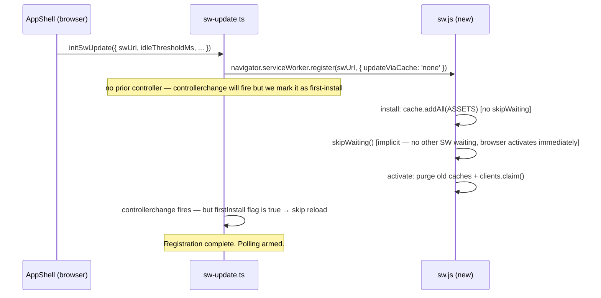
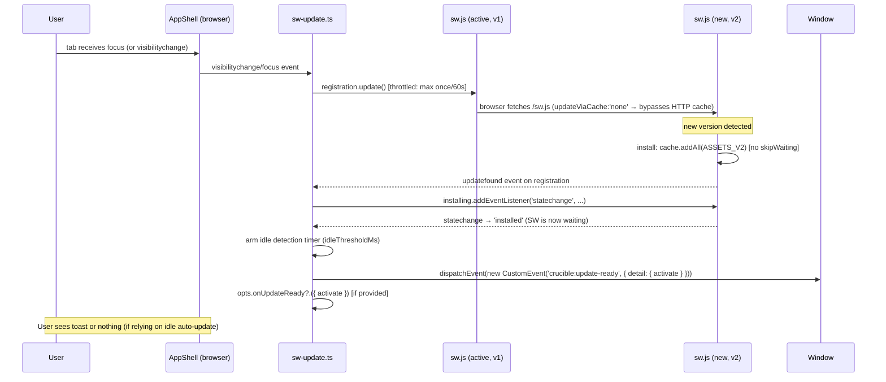
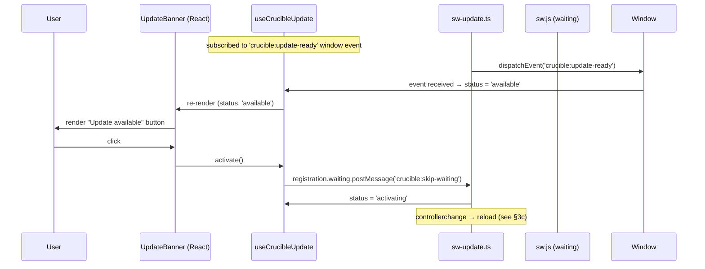

# SW Update — Framework Design

**Date:** 2026-05-08  
**Author:** sw-architect  
**Status:** SHIPPED under task #29. Subsumes #25, #26, #27. See "Diff from design" at the bottom for what landed vs. what was proposed.

---

## Overview

Crucible's service-worker update story today is nearly absent: no polling, unconditional `skipWaiting` on install, no event surface, no idle detection. The investigation in `sw-update-investigation.md` identified four bug clusters (P0 + P1 cluster + P2 cluster). This document designs how those fixes are packaged into a cohesive first-class framework feature with zero user-land boilerplate required and a clean opt-in extension surface.

**Design goals (verbatim from the user):**

- "primitives + functionalities for handling this that is extremely pragmatic"
- "auto-update if the user is detected to be idle"
- "emitting an event when a new update is available allowing the developer to determine how they want to display that to the user"

---

## 1. Public API Surface

### 1a. `AppShell` new props

`AppShell` gains an `swUpdate` strategy prop, following the strategy-prop pattern already in use for `matcher`, `scrollBehavior`, `focusBehavior`, and `onError`.

```ts
// crucible/ui/app-shell.tsx (new exports)

export type SwUpdateBehavior = {
  // Milliseconds of user inactivity before Crucible auto-applies a waiting
  // SW. Default: 5 minutes (300_000). Set to `Infinity` to disable idle
  // auto-update entirely.
  idleThresholdMs?: number;

  // Called when a new SW has installed and is waiting to activate.
  // `activate()` sends the skip-waiting message immediately.
  // If not provided, Crucible auto-dispatches `crucible:update-ready` on
  // `window` and relies on the default idle auto-update path.
  onUpdateReady?: (event: SwUpdateReadyEvent) => void;

  // Called when `navigator.serviceWorker.register()` rejects.
  // Use to route the error to Sentry/Datadog.
  onSwError?: (err: unknown) => void;
};

export type SwUpdateReadyEvent = {
  // Immediately send `crucible:skip-waiting` to the waiting SW.
  // Triggers `controllerchange` → page reload.
  activate: () => void;
};

// AppShellProps gains:
export type AppShellProps = {
  children: ReactNode;
  swUpdate?: SwUpdateBehavior;
};
```

**Usage — zero config (default, out-of-the-box):**

```tsx
<AppShell>
  {/* Crucible manages everything: polls on focus/visibility, waits for
      idle before auto-applying, dispatches window event. */}
  <App ... />
</AppShell>
```

**Usage — custom toast:**

```tsx
<AppShell swUpdate={{ onUpdateReady: ({ activate }) => {
  showToast("New version available", { action: { label: "Update", onClick: activate } });
}}}>
  <App ... />
</AppShell>
```

**Usage — aggressive auto-update (60 s idle):**

```tsx
<AppShell swUpdate={{ idleThresholdMs: 60_000 }}>
  <App ... />
</AppShell>
```

**Usage — disable idle auto-update, rely only on custom toast:**

```tsx
<AppShell swUpdate={{ idleThresholdMs: Infinity, onUpdateReady: myHandler }}>
  <App ... />
</AppShell>
```

### 1b. Window custom event

When no `onUpdateReady` prop is provided, or as a parallel signal regardless, Crucible dispatches:

```ts
// Declared in crucible/crucible-env.d.ts (global augmentation)
interface WindowEventMap {
  "crucible:update-ready": CustomEvent<SwUpdateReadyEventDetail>;
}

export type SwUpdateReadyEventDetail = {
  activate: () => void;
};
```

Consumers who don't use `AppShell`'s prop can listen on `window`:

```ts
window.addEventListener("crucible:update-ready", (e) => {
  showMyToast(e.detail.activate);
});
```

### 1c. `useCrucibleUpdate` React hook

A typed React hook for components that want to render update UI reactively:

```ts
// crucible/runtime/use-crucible-update.ts

export type SwUpdateStatus = "idle" | "available" | "activating";

export type CrucibleUpdateHandle = {
  status: SwUpdateStatus;
  // Imperatively triggers activation. Safe to call in any status;
  // no-ops if no waiting SW.
  activate: () => void;
};

export function useCrucibleUpdate(): CrucibleUpdateHandle;
```

**Usage:**

```tsx
function UpdateBanner() {
  const { status, activate } = useCrucibleUpdate();
  if (status !== "available") return null;
  return <button onClick={activate}>New version — click to update</button>;
}
```

The hook subscribes to the `crucible:update-ready` custom event on `window` (standard `useSyncExternalStore` or `useEffect` with event listener — no global store needed). This is the atomic-component pattern: no onClick prop drilling; the component owns its own subscription.

### 1d. New exports from `crucible.ts`

```ts
export { useCrucibleUpdate } from "./runtime/use-crucible-update.ts";
export type { CrucibleUpdateHandle, SwUpdateStatus } from "./runtime/use-crucible-update.ts";
export type { SwUpdateBehavior, SwUpdateReadyEvent } from "./ui/app-shell.tsx";
```

---

## 2. Internal Architecture

### 2a. Module boundaries

```
crucible/
  sw.ts                          — template; modified to remove unconditional
                                   skipWaiting; retains message handler
  ui/app-shell.tsx               — gains swUpdate prop; mounts SwUpdateManager
  runtime/sw-update.ts           — pure SW registration + lifecycle manager
                                   (no React; testable in isolation)
  runtime/use-crucible-update.ts — React hook backed by window event
```

The split mirrors the existing router layering: pure imperative logic (`sw-update.ts`) separate from the React surface (`use-crucible-update.ts`). `app-shell.tsx` is the mount point, as it already owns SW registration.

### 2b. `sw-update.ts` responsibilities

```ts
// crucible/runtime/sw-update.ts

export type SwUpdateOptions = {
  swUrl: string;
  idleThresholdMs: number;          // passed from AppShell prop
  onUpdateReady?: (event: SwUpdateReadyEvent) => void;
  onSwError?: (err: unknown) => void;
};

export function initSwUpdate(opts: SwUpdateOptions): () => void;
// Returns a teardown function (called on AppShell unmount).
```

Internally `initSwUpdate`:

1. Calls `navigator.serviceWorker.register(swUrl, { updateViaCache: 'none' })` (#25 P0).
2. Attaches `registration.update()` polling on `visibilitychange`/`focus` (throttled — once per 60 s) (#26 P1-A).
3. Listens for `updatefound` → `installing.statechange === 'installed'` → arms the waiting-SW path (#26 P1-B).
4. When a waiting SW is detected: starts idle-detection countdown; dispatches `crucible:update-ready` on `window`; calls `opts.onUpdateReady` if provided (#26 P1-C).
5. Listens for `controllerchange` → `window.location.reload()` (guarded against first-install by tracking whether a controller was present at registration time) (#26 P1-D).
6. Routes `register()` rejection through `opts.onSwError` (#27 P2-B).
7. Returns a teardown that clears all listeners and the idle timer.

### 2c. Idle-detection heuristic (see §3 for rationale)

Implemented inside `sw-update.ts`. Does NOT use the Idle Detection API (permission-gated, overkill). Uses a composite heuristic:

- **Input events that reset the idle clock:** `mousemove`, `keydown`, `pointerdown`, `scroll`, `touchstart` on `document` — all passive listeners.
- **Tab visibility:** if `document.visibilityState === 'hidden'`, the tab is considered idle regardless of the timer. Hidden tabs can auto-update immediately (no user is actively engaged).
- **Threshold:** `idleThresholdMs` (default 300_000 = 5 min). Starts ticking when a waiting SW is detected.
- **Trigger:** when the timer fires (or the tab is hidden), call `activate()` automatically — i.e. send `crucible:skip-waiting` to the waiting SW.

### 2d. SW template changes (`sw.ts`)

Remove `await self.skipWaiting()` from the `install` event. The SW now enters `waiting` state after caching assets, allowing the client to control when activation happens.

Add a cache-on-miss filter (#27 P2-A): only `cache.put` assets whose URL pathname starts with `/assets/` (Vite's hashed bundle directory). Dynamic non-hashed resources (API responses, uploaded files) bypass caching.

Add dev SW self-unregister (#27 P2-C): the dev no-op SW in `index.ts:configureServer` gains `self.addEventListener('activate', () => self.registration.unregister())` so stale dev registrations don't persist between branch switches.

---

## 3. Sequence Diagrams

### 3a. First install (no prior SW)



### 3b. Update discovered (update available path)



### 3c. Idle auto-update

```mermaid
sequenceDiagram
  participant User
  participant SWM as sw-update.ts
  participant NewSW as sw.js (waiting, v2)
  participant OldSW as sw.js (active, v1)

  Note over SWM: idle timer running since update-ready
  User->>SWM: no input for idleThresholdMs ms
  SWM->>SWM: idle threshold reached → call activate()
  SWM->>NewSW: registration.waiting.postMessage('crucible:skip-waiting')
  NewSW->>NewSW: skipWaiting() → becomes active
  NewSW->>OldSW: controllerchange fires in page
  SWM->>SWM: controllerchange handler → firstInstall=false → window.location.reload()
  Note over User: page reloads with new bundle; user was idle so no disruption
```

### 3d. User-gesture activate



### 3e. Error path

```mermaid
sequenceDiagram
  participant SWM as sw-update.ts
  participant Host as opts.onSwError

  SWM->>SWM: navigator.serviceWorker.register(...).catch(err)
  SWM->>Host: opts.onSwError(err)
  Note over SWM: No retry; SW failure is non-fatal. Page works without SW.
  Note over Host: App wires this to Sentry/Datadog. Default: console.error fallback.
```

---

## 4. Idle Detection Heuristic

### 4a. Why not the Idle Detection API

The [Idle Detection API](https://developer.chrome.com/docs/capabilities/idle-detection) requires the `'idle-detection'` permission prompt. That's unacceptable for a transparent framework feature — Crucible would force an unexpected permission dialog on every app that uses it. We use a page-scoped composite heuristic instead.

### 4b. Heuristic definition

**Idle = no user input events for `idleThresholdMs` AND tab is either focused or has been hidden for > 0 ms.**

Input events that reset the idle clock (all added as passive listeners on `document`):

| Event | Why |
|---|---|
| `mousemove` | Mouse movement = engaged |
| `keydown` | Keyboard input = engaged |
| `pointerdown` | Touch/stylus/mouse press = engaged |
| `scroll` | Scrolling = engaged |
| `touchstart` | Mobile touch start |

**Tab-hidden fast path:** when `document.visibilityState === 'hidden'` and a waiting SW exists, activate immediately without waiting for the idle timer. A hidden tab has no actively-engaged user.

**Threshold default: 5 minutes (300,000 ms).** Rationale: long enough to avoid disrupting a user reading a long page or filling a form; short enough that a user who steps away for a coffee break gets a fresh bundle when they return. Dashboards with long-lived unsaved state should prefer longer thresholds or `onUpdateReady` with explicit toast.

**Resetting:** any of the above input events resets the timer. The idle detection arms only after a waiting SW is detected — there's no background drain on idle apps with no pending update.

**Disable:** `idleThresholdMs: Infinity` skips idle auto-update entirely. The `crucible:update-ready` event still fires so the app can show a toast.

### 4c. Edge cases

- **Multiple tabs:** each tab runs its own idle detector. If tab A auto-updates, `controllerchange` fires in all tabs sharing the same origin, triggering a reload in all of them. This is correct and expected — SW activation is origin-wide. If you need per-tab control, set `idleThresholdMs: Infinity` and handle `crucible:update-ready` explicitly.
- **Rapid deploy + reopen:** if the user closes and reopens a tab within the update polling window, the new SW installs immediately (no waiting SW from a prior session). `skipWaiting` fires as part of first-install activation. No idle detection needed.
- **User mid-form:** the `keydown` reset ensures a user actively typing is never auto-updated. The only risk is a user who leaves a form half-filled and walks away — which is when the idle auto-update fires. Acceptable.

---

## 5. Configuration Model

All configuration lives on `AppShell`'s `swUpdate` prop. No global store, no Vite plugin option (the SW mechanism is runtime-only, not build-time).

| Config | Type | Default | Effect |
|---|---|---|---|
| `swUpdate.idleThresholdMs` | `number` | `300_000` | Idle timeout before auto-activate |
| `swUpdate.onUpdateReady` | `(e) => void` | `undefined` | Custom handler (toast, etc.). Also fires window event regardless. |
| `swUpdate.onSwError` | `(err) => void` | `undefined` | Route SW registration errors to Sentry/Datadog |
| *(omit `swUpdate`)* | — | — | All defaults apply. Polls, emits window event, auto-updates on idle after 5 min. |

**No feature flag.** The behavior is on by default once the fixed code ships. Migration (§7) covers why this is safe.

### 5a. Where the seam is

`AppShell` creates the `SwUpdateOptions` object from its props and passes it to `initSwUpdate`. The returned teardown is stored in a ref and called in a `useEffect` cleanup — same pattern as the existing `useEffect` for SW registration.

`initSwUpdate` is a pure side-effect function: it takes options, wires listeners, returns cleanup. It has no module-level state. Multiple mounts (StrictMode double-invoke) are safe because the cleanup function unregisters all listeners and timers before the second invocation.

---

## 6. Migration Path

### 6a. Compatibility

The changes are **fully backwards-compatible for apps that use `<AppShell>` without `swUpdate`**:

- Adding `updateViaCache: 'none'` (#25): transparent. The browser fetches `/sw.js` from network instead of HTTP cache. Users get faster update discovery with no behavior change.
- Removing unconditional `skipWaiting` (#26): the **only behavioral difference** is that a new SW now waits for idle or a user gesture before activating, instead of activating immediately. For apps that never had a "new version available" signal, the user experience improves (no surprise controller swaps mid-session). For apps that relied on the immediate skip-waiting, the default idle threshold of 5 min means updates still happen quickly for inactive tabs.
- The `crucible:update-ready` window event is additive — existing apps ignore it until they listen.
- `useCrucibleUpdate` is additive — new export, existing code unaffected.

### 6b. Breaking risk assessment

**Low.** The only case where removing `skipWaiting` from `install` could regress behavior is an app that explicitly wanted the "always live code" guarantee and is tolerant of mid-session swaps. That app can set `swUpdate={{ idleThresholdMs: 0 }}` to get immediate activation on update detection. Document this in the migration guide.

### 6c. Existing `crucible:skip-waiting` message handler in `sw.ts`

The existing handler (`self.addEventListener('message', ...)`) is correct and stays unchanged. The new `activate()` callback calls `registration.waiting.postMessage('crucible:skip-waiting')`, which hits this handler exactly.

### 6d. Apps not using `AppShell`

If a Crucible consumer bypasses `AppShell` and calls `navigator.serviceWorker.register` themselves, none of the new behavior applies. They adopt it by mounting `AppShell` (recommended) or calling `initSwUpdate` directly (exported as a lower-level API for advanced cases).

---

## 7. Test Strategy

### 7a. `sw-update.ts` — unit tests (no DOM)

Create `crucible/runtime/sw-update.test.ts`.

**Harness:** use `happydom` (already imported in `happydom.ts`) plus a minimal `ServiceWorkerRegistration` stub. The stub models:

```ts
type StubRegistration = {
  installing: StubWorker | null;
  waiting: StubWorker | null;
  active: StubWorker | null;
  update: () => Promise<void>;
  addEventListener: (event: string, cb: () => void) => void;
  // fires callbacks registered on 'updatefound'
  _fireUpdateFound: () => void;
};

type StubWorker = {
  state: ServiceWorkerState;
  postMessage: (msg: unknown) => void;
  addEventListener: (event: string, cb: () => void) => void;
  _setState: (s: ServiceWorkerState) => void;
};
```

**Test cases:**

| Test | What it verifies |
|---|---|
| `register() called with updateViaCache: 'none'` | P0 fix landed |
| `registration.update() called on visibilitychange (hidden→visible)` | P1-A polling |
| `registration.update() throttled to once per 60s` | P1-A throttle |
| `crucible:update-ready dispatched when installing→installed` | P1-C event |
| `opts.onUpdateReady called when installing→installed` | P1-C callback |
| `registration.waiting.postMessage sent on activate()` | P1-B wire |
| `window.location.reload called on controllerchange (non-first-install)` | P1-D reload |
| `controllerchange does NOT reload on first install` | first-install guard |
| `idle timer fires activate() after idleThresholdMs` | idle auto-update |
| `input events reset idle timer` | idle reset |
| `hidden tab activates immediately` | hidden-tab fast path |
| `idleThresholdMs: Infinity disables auto-update` | disable path |
| `opts.onSwError called on register() rejection` | P2-B error hook |
| `teardown removes all listeners` | cleanup correctness |

**Deterministic idle testing:** inject a `Date.now` or `performance.now` mock + a fake `setTimeout`/`clearTimeout` via dependency injection on `initSwUpdate`. The function accepts an optional `_clock` parameter (internal, not in the public type) so tests can advance time without real timers.

### 7b. `sw.ts` template — VM harness tests

Extend existing `sw-and-pwa.test.ts` (or a new `sw-lifecycle.test.ts`).

**Harness:** evaluate the generated SW source string in a `vm.createContext` with stubbed globals:

```ts
const ctx = vm.createContext({
  self: {
    addEventListener: (ev: string, cb: Function) => { handlers[ev] = cb; },
    skipWaiting: vi.fn().mockResolvedValue(undefined),
    clients: { claim: vi.fn().mockResolvedValue(undefined) },
    location: { origin: "https://app.test" },
    registration: { unregister: vi.fn() },
  },
  caches: stubCaches(),
  fetch: vi.fn(),
  URL,
});
```

**Test cases:**

| Test | What it verifies |
|---|---|
| `install handler caches all ASSETS` | cache.addAll called with the right list |
| `install handler does NOT call skipWaiting` | P1-B SW-side fix |
| `message 'crucible:skip-waiting' calls skipWaiting` | existing handler still works |
| `activate handler deletes prior crucible-* caches` | prior-cache purge |
| `fetch navigate → network-first → index.html fallback` | offline nav |
| `fetch /assets/foo.hash.js → cache-first` | asset cache |
| `fetch /non-asset.json → passes through, no cache.put` | P2-A filter |
| `dev SW self-unregisters on activate` | P2-C fix |

### 7c. `useCrucibleUpdate` — React hook tests

Create `crucible/runtime/use-crucible-update.test.ts`.

**Harness:** `renderHook` from `@testing-library/react`.

**Test cases:**

| Test | What it verifies |
|---|---|
| `initial status is 'idle'` | initial state |
| `status becomes 'available' after crucible:update-ready event` | event subscription |
| `activate() from hook calls registration.waiting.postMessage` | activation path |
| `status becomes 'activating' after activate()` | state transition |
| `unmount removes event listener` | no leak |

**Event dispatch in tests:**

```ts
window.dispatchEvent(new CustomEvent("crucible:update-ready", {
  detail: { activate: mockActivate }
}));
```

No real SW registration needed; the hook is isolated to the window event.

### 7d. `AppShell` integration test

Extend or add to `crucible/sw-and-pwa.test.ts` (or a new `app-shell.test.tsx`).

**Test cases:**

| Test | What it verifies |
|---|---|
| `AppShell without swUpdate calls initSwUpdate with default idleThresholdMs` | defaults |
| `AppShell swUpdate.onUpdateReady prop forwarded to initSwUpdate` | prop threading |
| `AppShell unmount calls teardown` | cleanup |

Mock `initSwUpdate` at the module boundary so these tests are isolated from SW internals.

---

## 8. Open Questions

### Q1: Should `crucible:update-ready` also fire when `onUpdateReady` is provided?

Current design: always dispatch the window event AND call `onUpdateReady`. This lets apps use both the prop (for React component updates) and window listeners (for non-React code, Sentry breadcrumbs, etc.) simultaneously.

**Risk:** if the prop activates immediately and the window listener also calls `activate()`, we'd send two `postMessage` calls to the waiting SW. The second is a no-op (SW is already active by then), so it's harmless — but it could confuse metrics. Consider only dispatching the event when `onUpdateReady` is NOT provided.

**Question for Austin:** always fire both, or suppress window event when prop is present?

### Q2: `registration.update()` polling interval — 60 s or configurable?

The investigation suggests "60s is generous; 5min is conservative." Currently proposed: throttle to once per 60 s on visibility/focus events. This is not exposed as a config knob (YAGNI — it's an internal detail, not a seam the user needs). Confirm: not in the public API.

### Q3: Should `initSwUpdate` be a public export?

Advanced users (e.g. building their own shell without `AppShell`) could benefit from calling `initSwUpdate` directly. Cost: it becomes a stable API surface we need to version. Recommendation: export it but mark it `@internal` in JSDoc. Confirm whether to export.

### Q4: `SwUpdateBehavior` in `AppShellProps` — should `swUpdate` default to `{}` (always-on) or `undefined` (opt-in)?

Current design: always-on when `AppShell` is used (the `swUpdate` prop defaults to `{}`). The only opt-out is `swUpdate={{ idleThresholdMs: Infinity }}`. This aligns with the "pragmatic out-of-the-box" goal. If for some reason the user wants NO SW update management at all (e.g. Electron-only builds, though those are skipped via `isElectron()`), they'd need an explicit escape hatch.

**Question for Austin:** should there be a `swUpdate={false}` escape hatch, or is `Infinity` enough?

### Q5: Idle detection on mobile — `touchstart` sufficient?

Mobile browsers suspend JS timers when the tab is backgrounded, so the idle timer may not fire reliably. The hidden-tab fast path (`visibilityState === 'hidden'`) covers the case where the user locks their phone. For a user who leaves a mobile browser tab open in the foreground without touching it, the `touchstart`/`scroll` reset events ensure they don't get auto-updated mid-interaction — but the timer may not advance while the tab is frozen. This is acceptable: a frozen tab is effectively idle, and when the browser unfreezes it and fires `visibilitychange`, the update will have already happened via the hidden-tab fast path or the next focus poll.

**Not a question, flagging for awareness.** No API decision needed.

---

## Appendix: File map for implementation (#25, #26, #27)

| File | Change |
|---|---|
| `crucible/sw.ts` | Remove `await self.skipWaiting()` from install; add `/assets/` cache-put filter; dev SW gains self-unregister |
| `crucible/ui/app-shell.tsx` | Add `swUpdate?: SwUpdateBehavior` prop; call `initSwUpdate` from `useEffect`; teardown on unmount |
| `crucible/runtime/sw-update.ts` | New file — pure registration + lifecycle manager |
| `crucible/runtime/use-crucible-update.ts` | New file — React hook |
| `crucible/crucible.ts` | Export `useCrucibleUpdate`, `CrucibleUpdateHandle`, `SwUpdateStatus`, `SwUpdateBehavior`, `SwUpdateReadyEvent` |
| `crucible/crucible-env.d.ts` | Augment `WindowEventMap` with `crucible:update-ready` |
| `crucible/index.ts` | Dev SW gains self-unregister on activate in `configureServer` |
| `crucible/runtime/sw-update.test.ts` | New test file |
| `crucible/runtime/use-crucible-update.test.ts` | New test file |
| `crucible/sw-and-pwa.test.ts` | Extend with SW lifecycle VM harness tests |
| `crucible/docs/pwa.md` | Document `Cache-Control: no-cache` expectation for `/sw.js` on production hosts |

---

## Diff from design (what landed vs. what was proposed)

| Area | Design proposed | Shipped | Why |
|---|---|---|---|
| Q1 (event vs. prop gating) | "always fire both" — leaning | **Always fire both, unconditionally** | Team-lead resolution: window event is a contract independent of whether the prop is passed. `activate()` is idempotent so the double-call is harmless. |
| Q2 (poll throttle config) | not exposed | **not exposed** (matches design) | YAGNI; internal detail. |
| Q3 (export `initSwUpdate`) | "export with `@internal`" | **Not exported** | Team-lead resolution: premature exports are forever. Public surface stays at `<AppShell swUpdate>`, `useCrucibleUpdate()`, and the `crucible:update-ready` window event. `initSwUpdate` is exported from the runtime module so `app-shell.tsx` and tests can use it, but never re-exported via `crucible.ts`. |
| Q4 (`swUpdate={false}` escape hatch) | proposed asking | **`idleThresholdMs: Infinity` is the only opt-out for auto-activate** | Team-lead resolution: bug fixes (`updateViaCache: 'none'`, polling, deferred skipWaiting, controllerchange reload, cache-on-miss filter, dev SW self-unregister, onSwError callback) are framework defaults — NOT opt-out. Made explicit via JSDoc on `SwUpdateBehavior.idleThresholdMs` and in `docs/pwa.md`. |
| Test file naming | `runtime/use-crucible-update.test.ts` | `runtime/use-crucible-update.test.tsx` | The hook tests render JSX; .tsx is required. |
| AppShell test approach | "mock `initSwUpdate` at module boundary" | **Stubbed `navigator.serviceWorker` instead** | `mock.module()` is process-global in Bun's test runner; mocking `sw-update.ts` from `app-shell.test.tsx` clobbered its `_internals` export and broke `sw-update.test.ts`. The end-to-end stub via `navigator.serviceWorker.register` captures the same prop-threading signal without cross-file pollution. |
| Idle test harness | "inject `Date.now`/timers" | **Internal `_clock` parameter** with `now`/`setTimeout`/`clearTimeout` triple — inline, not in the public type | Production passes nothing (defaults to real clock); tests pass a fake. Avoids exposing test seam in the public API. |
| `crucible-env.d.ts` augmentation | `WindowEventMap['crucible:update-ready']: CustomEvent<SwUpdateReadyEventDetail>` | **Same shape, named `CrucibleSwUpdateReadyEventDetail`** | Avoid name collision with the runtime-exported `SwUpdateReadyEventDetail` (the .d.ts is a global, the runtime export is a module export — keeping them distinct removes a class of "did you mean the global or the module" confusion). |
| Cache-Control header | "set in dev middleware + document for prod" | **Done** | Dev middleware sends `Cache-Control: no-cache, no-store, must-revalidate`. Production hosting doc added to `pwa.md` with Vercel + CloudFront + nginx examples. |
| SW template — `cache.put` filter | "only `cache.put` for `/^\/assets\//`" | **Same** (`url.pathname.startsWith("/assets/")`) | Mirrors design exactly. |
| SW template — install | "remove `await self.skipWaiting()`" | **Same** | Mirrors design exactly. |
| Dev SW self-unregister | proposed | **Done in `index.ts:configureServer`** | `await self.clients.claim(); await self.registration.unregister()` in the activate handler so a stale dev SW tears itself down on the next page load. |

### Net surface added to `crucible.ts`

```ts
export {
  AppShell,
  type AppShellProps,
  type AppleStatusBarStyle,
  type HexColor,
  type SwUpdateBehavior,         // NEW
} from "./ui/app-shell.tsx";
export {
  useCrucibleUpdate,             // NEW
  type CrucibleUpdateHandle,     // NEW
  type SwUpdateStatus,           // NEW
} from "./runtime/use-crucible-update.ts";
export type {
  SwUpdateReadyEvent,            // NEW
  SwUpdateReadyEventDetail,      // NEW
} from "./runtime/sw-update.ts";
```

`initSwUpdate` is intentionally NOT in the export map. Consumers go through `<AppShell>`.

### Test counts

- `runtime/sw-update.test.ts` — **20 tests** (registration shape, P0 fix, update detection, polling + throttle, idle auto-activate + Infinity disable + visibility fast paths, controllerchange + first-install guard, teardown idempotency, environment guards).
- `runtime/use-crucible-update.test.tsx` — **7 tests** (initial idle, transition to available, activate forwards, activating status, no-op-when-idle, idempotency, listener cleanup on unmount).
- `ui/app-shell.test.tsx` — **7 tests** (P0 default register options, default mount, idleThresholdMs forward, Infinity opt-out, onSwError no-throw, prop-change re-init, unmount safety).
- `sw-and-pwa.test.ts` — **8 new SW lifecycle tests** appended (install precaches + does NOT skipWaiting, activate purges + claims, fetch routing for non-GET / cross-origin / navigate / `/assets/` cache-first / non-`/assets/` no-cache.put, message handler skipWaiting + ignores other messages).

Suite total: 266 → 310 (+44).
