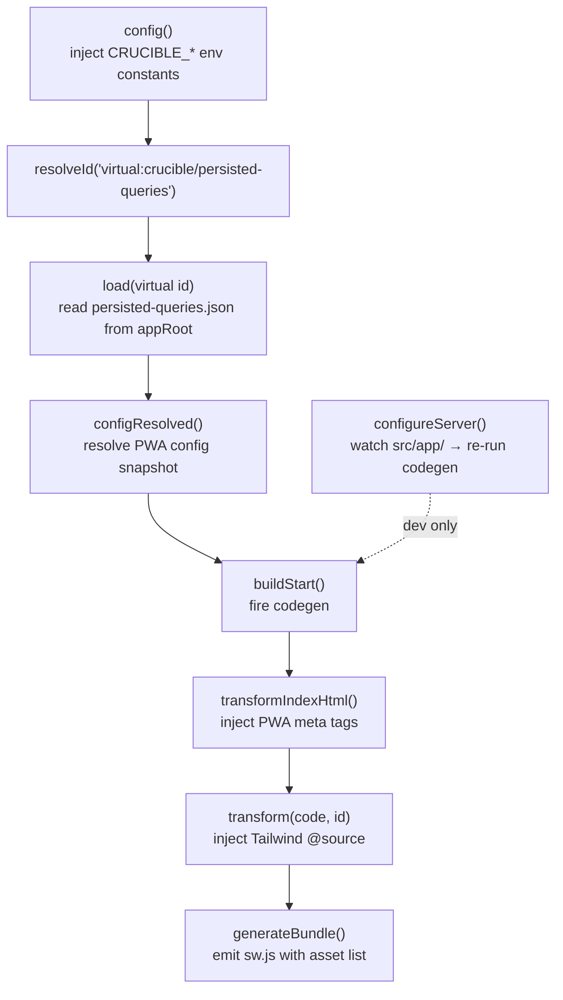

# Vite plugin

The `crucible({ ... })` plugin is the build-time + dev-server glue. This doc enumerates the hooks it implements and what each one does.

## Usage

```ts
// vite.config.ts
import { crucible } from "react-crucible";
import react from "@vitejs/plugin-react";
import tailwindcss from "@tailwindcss/vite";
import { fileURLToPath } from "node:url";
import { dirname, resolve } from "node:path";

const here = dirname(fileURLToPath(import.meta.url));

export default {
  // Vite's project root must point at .crucible/, where the generated
  // index.html and main.tsx live. Crucible owns that file.
  root: resolve(here, ".crucible"),

  // Static assets stay in public/ at the app root.
  publicDir: resolve(here, "public"),

  build: {
    outDir: resolve(here, ".crucible/build/web"),
    emptyOutDir: true,
  },

  resolve: {
    alias: [
      // Bare `crucible` specifier resolves to the framework's typed surface
      { find: /^crucible$/, replacement: resolve(here, "node_modules/react-crucible/crucible.ts") },
      // App's `@/foo` shorthand
      { find: /^@\/(.*)$/, replacement: resolve(here, "./src/$1") },
    ],
  },

  plugins: [
    crucible({ appRoot: here }),  // <-- here
    react(),
    tailwindcss(),
  ],
};
```

## Options

```ts
type CrucibleOptions = {
  appRoot?: string;
  pwa?: PWAConfig;
  crucibleSpecifier?: string;
};
```

| Option | Default | Purpose |
|---|---|---|
| `appRoot` | `process.cwd()` | The consuming app's root. Where `src/app/`, `persisted-queries.json`, and `.crucible/` live. |
| `pwa` | `null` | Fallback PWA config used when `src/app/manifest.ts` doesn't exist. Prefer the file-based manifest. |
| `crucibleSpecifier` | `"react-crucible"` | npm specifier for crucible itself, embedded into generated `import` statements. Override when published or aliased under a different name. |

## Hooks (in order)



### `config()`

Injects three build-time constants via Vite's `define` map. The runtime reads them as `import.meta.env.*`:

| Constant | Value | Used by |
|---|---|---|
| `CRUCIBLE_SW_URL` | `"/sw.js"` if PWA configured, else `null` | `<AppShell>` decides whether to register the service worker |
| `CRUCIBLE_MANIFEST_URL` | `"/manifest.webmanifest"` if PWA configured, else `null` | `<DocumentHead>` decides whether to emit `<link rel="manifest">` |
| `CRUCIBLE_SCHEMA_HASH` | FNV-1a of `schema.graphql` content | Relay environment uses it as the localStorage cache key, so a schema change orphans stale records |

### `resolveId` + `load`: virtual modules

Resolves the virtual module `virtual:crucible/persisted-queries` so the runtime's `environment.ts` can `import persistedQueries from "virtual:crucible/persisted-queries"` regardless of where the package is installed. The plugin reads `<appRoot>/persisted-queries.json` from the consuming app — NOT from crucible's own directory.

This fixes a class of "works in Crucible but breaks in another consumer" bugs that would otherwise come from a hardcoded `../../persisted-queries.json` path.

### `configResolved()`

Reads `.crucible/_internal/manifest.json` (the snapshot codegen wrote) and resolves the PWA config. Stores the resolved object on the plugin instance so other hooks can reach it.

### `buildStart()`

Fires `runCodegen({ appRoot })`. This means by the time Vite starts module resolution, `.crucible/` exists with `routes.ts`, `entrypoints/*.ts`, `main.tsx`, `index.html`, and `registry.d.ts`. Codegen is synchronous; the build doesn't proceed until it finishes.

### `transformIndexHtml()`

For each entry the resolved PWA config declares (manifest link, theme-color override, apple-touch-icon, etc.), emit a corresponding `<meta>` or `<link>` tag into `<head>`.

### `transform(code, id)`

Tailwind v4 + Crucible's `.crucible/` root has a known interaction: Tailwind's auto-content-scan starts from Vite's root (`.crucible/`) and misses files under `src/`. The fix is an `@source` directive in any CSS file that imports Tailwind. We append it automatically when we detect `@import "tailwindcss"`:

```css
/* original */
@import "tailwindcss";
/* injected by crucible: */
@source "../src/**/*.{ts,tsx,js,jsx,html}";
```

Doesn't fire on non-CSS files. Doesn't fire on CSS files that don't import Tailwind.

### `generateBundle()`

Walks the emitted bundle, computes a content hash of the asset filenames + sizes, and writes `sw.js` with the asset list embedded. The service worker uses the hash as its cache version — new build → new hash → old cache purged on activate.

### `configureServer(server)`

Dev-only. Watches `src/app/` for `.ts`, `.tsx`, `.graphql` file adds/removes:

- **Structural change** (file added/removed) → re-run codegen + send a full reload to the dev server. Required because the routes manifest changed; Fast Refresh can't HMR through it.
- **Content change** (existing file edited) → don't re-run codegen. Vite's HMR + React Fast Refresh handle the update.
- **Manifest file change** (`src/app/manifest.ts`) → re-resolve PWA config and full-reload.

Also serves a no-op `/sw.js` so registering the SW in dev doesn't 404.

## What the plugin does NOT do

- **It doesn't run relay-compiler.** Run that separately (Crucible's `bun run codegen` chains them).
- **It doesn't bundle.** Vite handles bundling. The plugin only emits artifacts and intercepts virtual modules.
- **It doesn't transpile your code.** `@vitejs/plugin-react` (or your equivalent) does that. The plugin's `transform` hook is just for the Tailwind `@source` injection.
- **It doesn't manage the dev server.** Vite does. The plugin's `configureServer` only adds a watcher and the SW middleware.

## Debugging

Codegen output is in `.crucible/`. If routes aren't resolving as expected:

1. `cat .crucible/routes.ts` — does the route exist?
2. `cat .crucible/registry.d.ts` — does the type registry have it?
3. `cat .crucible/entrypoints/<id>.ts` — does the entrypoint look right?

If a query isn't being preloaded:

1. Check the page exports a `Queries` type alias (not an interface, not inline).
2. Check the GraphQL operation has `@preloadable`.
3. `bun run codegen:relay` — did relay-compiler emit the artifact?
4. `bun run codegen:crucible` — did Crucible's emit pick it up?

The codegen CLI is fast (~tens of milliseconds for the Crucible app). Run it manually as often as you want.
